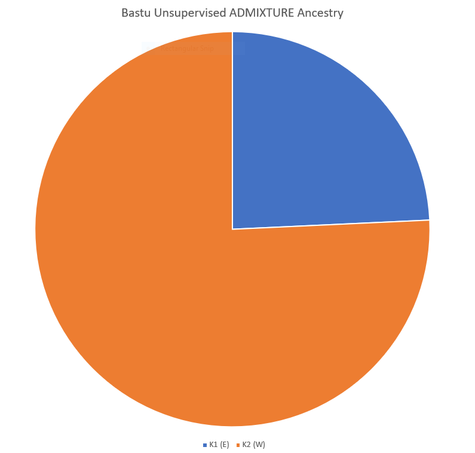
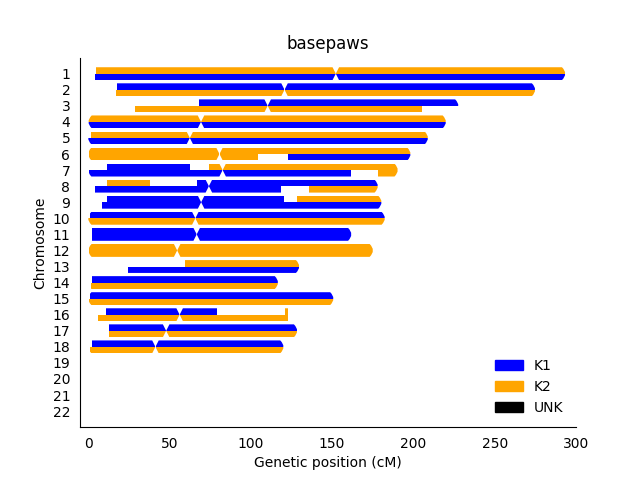

First, I should thank a basepaws staff member for pointing out that there is genotype data available in the supplemental materials for [Gandolfi et al. 2018](https://www.nature.com/articles/s41598-018-25438-0) (during a discussion at [CatCon](https://www.catconworldwide.com/)).

I don't think the ancestry information is available there, but I will follow-up to see if I either over-looked something (or if I can otherwise obtain that information).

In the meantime, the information in the paper is sufficent for some unsupervised ADMIXTURE analysis.

**While I haven't given up on the possiblity of running supervised ADMIXTURE analysis, the unsupervised analysis already matches my UC-Davis report in that Bastu has greater Western Ancestry than Eastern Anestry (assuming that "SFold" is Scottish Fold with Western Ancestry, and "CR" has Eastern Ancestry)**:

I originally thought that samples starting with CR were Cornish Rex, but that doesn't appear to be correct.  I am going to work on figuring out the best way to share information, but the FID in the supplemental files corresponds to the breed.  I think they are in alphabetical order by domestic cat(so that those CR samples have FID 6 and are actually BIR Birman samples, although Eastern is the correct grouping for BIR cats) followed by wild cat, but I will follow-up with information about the more precise mapping.



I still don't have my basepaws report.  However, when I do, I would expect a higher Western fraction (although an even higher "Polycat" fraction would also be fair).

I've also done some testing of down-sampling markers for the broadest level of human ancestry (which is kind of like the "Eastern" and "Western" cat ancestry), which you can see [here](https://github.com/cwarden45/DTC_Scripts/blob/master/Genes_for_Good/RFMix_ReAnalysis/Downsample_Test/README.md).

I noticed an earlier [basepaws blog post](https://www.basepaws.com/blog/new-basepaws-reports-announcement-136) which looked relatively good (in that the cat was >50% polycat).  However, that is often not what I see in the [Facebook discussion group](https://www.facebook.com/groups/BasepawssadorsCatDNAClub), and I would expect that most cats should be polycats.  Nevertheless, that is the sort of thing that I am trying to look into.

It's a separate project, but there are also pictures of some of the "[trios](http://felinegenetics.missouri.edu/99lives/successfully-sequenced-cats)" from the 99 Lives project, to get an idea about the difference in physical appearance among closely-related but admixed cats.

Given that [Cinnamon](https://www.nature.com/news/2007/071031/full/news.2007.208.html) has both SNP chip and [WGS](https://www.ebi.ac.uk/ena/data/view/SRX2376197) data, I think I can use that to better verify the genotypes that I re-processed (comparing the genotypes to Bastu's variants) as well as expand the number of sites used.  Cinnamon was originally selected based upon inbreeding (and a blind phenotype, I believe), but most of the variants currently in the reformatted .vcf are heterozygous (and even if a site was homozygous, my current limitation is my confidence that I am selecting the right SNP chip genotype as the reference allele).

-----------------

**Code Notes**

```diff
- Please note that I may not be able to help with troubleshooting this code.  So, this part is for experienced users only!
```

**0)** Prepare reference FASTA (if needed)

**1)** Prepare gVCF.  I ordered the ~15x sequencing for $1000, so I was provided a gVCF.  However, I believe it was repeat regions were filtered.  So, this caused some issues with matching positions covered by the cat array, and I used `create_GATK_gVCF.sh` (from a [different repository](https://github.com/cwarden45/DTC_Scripts/blob/master/Helix_Mayo_GeneGuide/IBD_Genetic_Distance/create_GATK_gVCF.sh)) to create a gVCF.

**2)** For felCat8, you can reformat the supplemental materials to create a .vcf (with a subset of variants) using `onvert_SupplementaryTable5_to_VCF-and-PED.pl`.

My strategy ended up filtering a lot of probes (requiring two genotypes that exactly match the reference and alternative expected from the probe design).  While most (~57k) probes had a BLAST hit to felCat9, I only used ~20k probes.  However, perhaps I can improve this in the future.  For example, I believe there are alternative sets of genotypes to export from GenomeStudio that may make the gVCF comparison easier.

You can also do this for felCat9 using `convert_SupplementaryTable5_to_VCF-and-PED_felCat9.pl`, but you will first need to run `convert_probe_table_to_FASTA.pl` and `create_felCat9_map_from_probe_BLAST.R`.  Currently, the number of probes meeting my requirement to combine with a GATK gVCF is within 1000 probes for either felCat8 or felCat9.

FYI, there are two different positions provided in Supplementary Table 5 (I believe for felCat6 and felCat8), but I am seeing if there is something available for felCat9 (as well as having a script that maps some extra probes to felCat9).  I noticed the felCat9 lift-over .chain files were only for [felCat5 and felCat8](http://hgdownload.soe.ucsc.edu/goldenPath/felCat9/liftOver/), but I believe there is archived felCat6 data available from NCBI FTP.

**3)** Create a combined VCF (the SNP chip reference panel and your WGS gVCF) using `combine_VCF.pl`.

The code above assumes the felCat8 reference has chromosomes as characters (like "chrA1" but the SNP chip has chromosomes as numbers like "1").  So, you may need to edit the script, and this is probably a good time to provide a warning that ***I unfortuantely won't be able to provided detailed troubleshooting with these scripts*** (although I would be extremely happy if you already had coding experience, and you find hosting this code useful).

**4)** Reformat the combined VCF and run (unsupervised) ADMIXTURE using `plink_ADMIXTURE.sh`.

Even though they both use Ubuntu, I ended up actually running [plink2](http://www.cog-genomics.org/plink/2.0/) within Windows10 (Bash on Ubuntu) and I ran [ADMIXTURE](http://software.genetics.ucla.edu/admixture/download.html) from a Docker image.

**5)** Create genetic map files and phase variants using [SHAPEIT](https://mathgen.stats.ox.ac.uk/genetics_software/shapeit/shapeit.html).

There is also some genetic mapping information in the supplemental information from [Li et al. 2019](https://www.g3journal.org/content/6/6/1607.supplemental).

**WARNING**: I think there are still some details that I need to look into (based upon a comparison of supplmental files for [Li et al. 2016](https://www.g3journal.org/content/6/6/1607.supplemental) and [Gandolfi et al. 2018](https://www.nature.com/articles/s41598-018-25438-0)).  However, I wanted to put together some code and get a rough idea of what those results look like (even though they probably need some additional refinement).

In other words, I could create files that technically ran without errors by running `reformat_Li_et_al_2016-TableS1.pl` followed by `run_SHAPEIT.pl`.  However, this may change in the future.

The code from this step on is similar to re-analysis of [my own human samples](https://github.com/cwarden45/DTC_Scripts/tree/master/Genes_for_Good/RFMix_ReAnalysis).

**6)** Create .classes file, filter phased files (if necessary), and define ancestry segments using [RFMix](https://sites.google.com/site/rfmixlocalancestryinference/).

For unsupervised ADMIXTURE analysis, I defined a reference set of samples with a proportion of ancestry greater than 90% when K=2 (and the test sample) with the code `create_filtered_vcf-sample-haps_UNSUPERVISED.pl`.

As noted in the code for the [human RFMix analysis](https://github.com/cwarden45/DTC_Scripts/blob/master/Genes_for_Good/RFMix_ReAnalysis/README.md), certain dependencies come from [Alicia Martin's Ancestry Pipeline](https://github.com/armartin/ancestry_pipeline).  It would probably be best if I revised the plotting function in the future.

The script to currently run that step is `run_RFMix_v1.5.4_basepaws.pl`.  **I might still have some bugs to work out** (I was esentially getting one color for each chromosome - which is very different than either the human results or what I have seen in other people's reports).  However, this is also not a random result.

So, I am plotting it down here, instead of above:


