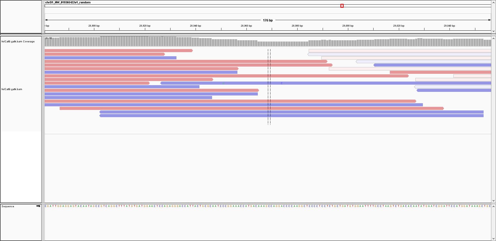

This subfolder contains some information moved from the [Health_Trait_Markers](https://github.com/cwarden45/Bastu_Cat_Genome/edit/master/Basepaws_Notes/Health_Trait_Markers) folder, along with some additional informaiton.

As still presented in that original location, this is what I can see using information from Wisdom Panel as well as the RefSeq annotations from other species:

In terms of more detailed information, along with additional files:

# felCat8 liftOver

I am currently not 100% sure if it is the full explanation, but the view for alignments in this region in felCat8 looks better:

# felCat6 BLAST hits

I think the alignment also looks good for felCat6:

 "alignment of Basepaws data for felCat6 BLAST mapping")

This is based upon the BLAST results uploaded in this subfolder, with the code in `run_BLAST.sh`

# Alternate felCat9 location

I think you could come to a similar conclusion if you started from felCat8 instead of felCat9, since you can see the supplemental chromosome **chrD1_NW_019365422v1_random** among the results uploaded here.

However, the path for me seeing this additional view of a complementary alignment was to learn that (as of 6/25/2022) basepaws does **not** use the Whole Genome Sequencing data to make the variant calls for the Whole Genome Sequencing kits.  Instead, additional Amplicon-Seq data is generated and used.

During the discussion to understand and identify an issue in my current basepaws reports, I was provided an additional file that represents a version of the amplicons relevant to this variant (uploaded on Google Drive [here](https://drive.google.com/file/d/1j_JWYY0Yq7A_jQJ34TUu-HbW1EyqAA8Q/view?usp=sharing)).

In that file, there is one sequence that has noticably more 100% identical amplicons than other 100% identical sequences.  I think that was the basis in agreeing that my cat should have 0 copies of the C-->T colorpoint mutation (although the strand is the opposite, so you are looking for a lack of a change from a G to an A).  This was after an intermediate suggestion that my cat had C-->TCC variant instead of a C-->T variant, but I think that was also shown to not be true (or at least not for the regions represented by the screenshots on this page).  I think understanding the sequence difference flanking this variant in the ***canonical*** chrD1 for felCat8 versus felCat9.

Either way, you can visualize the BLAT hit for that amplicon sequence for felCat9, and you can see that the sequence for **chrD1_NW_019365422v1_random:28881-29056** is a 100% match (on the positive strand).

I can then use the raw data to visualize that alignment:

***So, in fact, there is a genomic coordinate that can be used for felCat9 where you can visually see a lack of a variant for the colorpoint mutation!***
