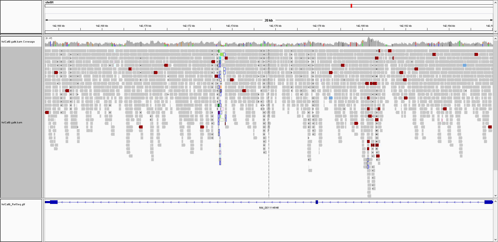
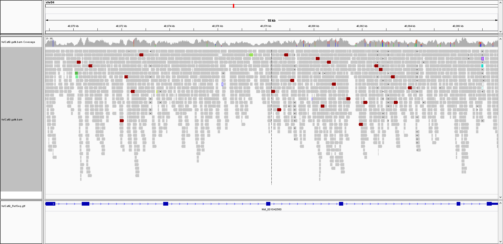

UC-Davis VGL "Ancestry Test" Traits
-----------------

<table>
  <tbody>
    <tr>
      <th align="center">Trait</th>
      <th align="center">Publications</th>
      <th align="center">Bastu's Result</th>
	  <th align="center">felCat9 Variant</th>
	  <th align="center">basepaws WGS Confirmation</th>
    </tr>
    <tr>
	    <td align="center"><b>Agouti</b><br><i>Also in <a href="https://www.vgl.ucdavis.edu/services/coatcolorcat.php">Coat Test</a></i></td>
      <td align="left"><a href="https://www.ncbi.nlm.nih.gov/pubmed/25143047">Gershony et al. 2014</a><br><a href="https://www.ncbi.nlm.nih.gov/pmc/articles/PMC3541004/">Lyons 2012</a></td>
      <td align="left">a/a</td>
	  <td align="left"><i>ASIP</i><br><i>: </i>(c.122_123delCA)</td>
	  <td align="left"></td>
    </tr>
    <tr>
	    <td align="center"><b>Brown</b><br><i>Also in <a href="https://www.vgl.ucdavis.edu/services/coatcolorcat.php">Coat Test</a></i></td>
      <td align="left"><a href="https://www.ncbi.nlm.nih.gov/pubmed/16104383">Lyons et al. 2005</a><br><a href="https://www.ncbi.nlm.nih.gov/pubmed/15858157">Schmidt-Küntzel et al. 2005</a><br><a href="https://www.ncbi.nlm.nih.gov/pmc/articles/PMC3541004/">Lyons 2012</a></td>
      <td align="left">B/B</td>
	  <td align="left"><i>TYRP1</i><br><i>: </i>(c.8C > G)<br><i>: </i>(c.298C > T)</td>
	  <td align="left"></td>
    </tr>
    <tr>
	    <td align="center"><b>Colorpoint</b><br><i>Also in <a href="https://www.vgl.ucdavis.edu/services/coatcolorcat.php">Coat Test</a></i></td>
      <td align="left"><a href="https://www.ncbi.nlm.nih.gov/pubmed/15771720">Lyons et al. 2005</a><br><a href="https://www.ncbi.nlm.nih.gov/pmc/articles/PMC3541004/">Lyons 2012</a></td>
      <td align="left">C/C</td>
	<td align="left"><i>TYR (chrD4:40,068,827-40,087,673)</i><br><i>: </i>(<b>C<sup>b</sup></b>,c.715G>T)<br><i>: </i>(<b>C<sup>S</sup></b>,c.940G>A)<br><i>: </i>(<b>c</b>, c.975delC)</td>
      <td align="left"></td>
    </tr>
    <tr>
	    <td align="center"><b>Dilute</b><br><i>Also in <a href="https://www.vgl.ucdavis.edu/services/coatcolorcat.php">Coat Test</a></i></td>
      <td align="left"><a href="https://www.ncbi.nlm.nih.gov/pubmed/16860533">Ishida et al. 2006</a><br><a href="https://www.ncbi.nlm.nih.gov/pmc/articles/PMC3541004/">Lyons 2012</a></td>
      <td align="left">D/d</td>
	  <td align="left"><i>MLPH (chrC1:219,396,738-219,434,022)</i><br><i>: </i>(c.83delT)</td>
	  <td align="left"></td>
    </tr>
    <tr>
	    <td align="center"><b>MC1R</b><br><i>Also "Amber" in <a href="https://www.vgl.ucdavis.edu/services/coatcolorcat.php">Coat Test</a></i></td>
      <td align="left"><a href="https://www.ncbi.nlm.nih.gov/pubmed/19422360">Peterschmitt et al. 2009</a><br><a href="https://www.ncbi.nlm.nih.gov/pmc/articles/PMC3541004/">Lyons 2012</a></td>
      <td align="left">E/E</td>
	  <td align="left"><i>MC1R</i><br><i>: </i>(c.250G>A)</td>
	  <td align="left"></td>
    </tr>
    <tr>
	    <td align="center"><b>Long Hair</b><br><i>Also in <a href="https://www.vgl.ucdavis.edu/services/cat/CatLongHair.php">Long Hair Test</a></i></td>
      <td align="left"><a href="https://www.ncbi.nlm.nih.gov/pubmed/17433015">Drogemuller et al. 2007</a><br><a href="https://www.ncbi.nlm.nih.gov/pubmed/17767004">Kehler et al. 2007</a><br><a href="https://www.ncbi.nlm.nih.gov/pmc/articles/PMC3541004/">Lyons 2012</a></td>
      <td align="left">N/M3</td>
	  <td align="left"><i>FGF5 (chrB1:142,165,360-142,186,050)</i><br><i>B1: </i>(<b>M1</b>, c.356insT)<br><i>B1: </i>(<b>M2</b>, c.406C>T)<br><i>B1: </i>(<b>M3</b>, c.474delT)<br><i>B1: </i>(<b>M4</b>, c.475A>C)</td>
	  <td align="left"></td>
    </tr>
    <tr>
	    <td align="center"><b>Cornish</b><br><i>Also in <a href="https://www.vgl.ucdavis.edu/services/cat/CornishRex.php">Cornish Rex Coat Test</a></i></td>
      <td align="left"><br><a href="https://www.ncbi.nlm.nih.gov/pmc/articles/PMC3541004/">Lyons 2012</a></td>
      <td align="left">N/N</td>
      <td align="left"><i>KRT71</i></td>
      <td align="left"></td>
    </tr>
    <tr>
	    <td align="center"><b>Devon</b><br><i>Also in <a href="https://www.vgl.ucdavis.edu/services/cat/SphynxDevonRexCoat.php">Sphynx/Devon Rex Test</a></i></td>
      <td align="left"><a href="https://www.ncbi.nlm.nih.gov/pubmed/20953787">Gandolfi et al. 2010</a><br><a href="https://www.ncbi.nlm.nih.gov/pmc/articles/PMC3541004/">Lyons 2012</a></td>
      <td align="left">N/N</td>
	  <td align="left"><i>KRT71</i><br><i>: </i>(c.1108-4_1184del)<br><i>: </i>(c.1184_1185ins AGTTGGAG)<br><i>: </i>(c.1196insT)</td>
	  <td align="left"></td>
    </tr>
    <tr>
	    <td align="center"><b>Sphynx</b><br><i>Also in <a href="https://www.vgl.ucdavis.edu/services/cat/SphynxDevonRexCoat.php">Sphynx/Devon Rex Test</a></i></td>
      <td align="left"><a href="https://www.ncbi.nlm.nih.gov/pubmed/20953787">Gandolfi et al. 2010</a><br><a href="https://www.ncbi.nlm.nih.gov/pmc/articles/PMC3541004/">Lyons 2012</a></td>
      <td align="left">N/N</td>
	  <td align="left"><i>KRT71</i><br><i>: </i>()</td>
	  <td align="left"></td>
    </tr>
    <tr>
	    <td align="center"><b>Selkirk Rex</b><br><i>Also in <a href="https://www.vgl.ucdavis.edu/services/cat/SelkirkRex.php">Selkirk Rex Coat Test</a></i></td>
      <td align="left"><a href="https://www.ncbi.nlm.nih.gov/pmc/articles/PMC3695623/">Filler et al. 2012?</a></td>
      <td align="left">N/N</td>
	  <td align="left"></td>
	  <td align="left"></td>
    </tr>
    <tr>
	    <td align="center"><b>Scottish Fold</b><br><i>Also in <a href="https://www.vgl.ucdavis.edu/services/ScottishFold.php">Scottish Fold Test</a></i></td>
      <td align="left"><a href="https://en.wikipedia.org/wiki/Scottish_Fold">Wikipedia</a></td>
      <td align="left">N/N</td>
	  <td align="left"></td>
	  <td align="left"></td>
    </tr>
</tbody>
</table>

I think validating these markers in my WGS data may be more difficult than I was expecting.  For example, there were relatively few mutations in the [cat GAPDH gene](https://github.com/cwarden45/Bastu_Cat_Genome/blob/master/Basepaws_Notes/IGV_BWA-MEM_Realign_Coverage_GAPDH.PNG), but the handful of genes that I visualized in IGV seem to be noticably more divergent:

**FGF5 (Long Hair)**:


[Figure 1](https://www.ncbi.nlm.nih.gov/pmc/articles/PMC3756544/figure/F1/) in the [Kehler et al. 2007](https://www.ncbi.nlm.nih.gov/pubmed/17767004) paper makes it look like the stop codon is disrupted in M3 (causing a longer sequence to be translated.  However, I am having a hard time finding that deletion in my IGV view (although I should probably be using some code to parse the gene annotation file).

So, I think I may need to look into what exactly gets amplified with the primers from the [Kehler et al. 2007](https://www.ncbi.nlm.nih.gov/pubmed/17767004) primers in the supplemental materials:

*Exon Primers (Table A1)*:

```
>Exon1_F
CGCCGAGATCCATTCGAG
>Exon1_R
TAGATGCACCTTCACCCAAC
>Exon2_F
AGAGGAGTCTGTGTTTTATTTTGGG
>Exon2_R
GTAAAATCTCYRTAACACCTTTAAC
>Exon3_F
GACCTCATTTTATTAGATGCT
>Exon3_R
AAGGCATGGTTTCTCACCAG
```

*M1/M2 Primers (Table A2a)*:
```
>M1_F
TGTAAAACGACGGCCAGTTCTACTGCAGAGTGGGCATC
>M1_R
GTGTCTTGCTTAGGACGCGCTTTGC
>M1_F
GTGTCTTGTACCTCAGGGGATTGTAGGAGTA
>M1_R
TGTAAAACGACGGCCAGTTCTCCTGTAACACCTTTAACAAACA
```

*M3/M4 Primers (Table A2b)*:

```
>M3_M4_F
TGTAAAACGACGGCCAGTGACCTCATTTTATTAGATGCT
>M3_M4_R
GTGTCTTACCGTCTCCCTGAACTTGCAGTCAACG
```

**TYR (Lynx/Siamese Point, Colorpoint Restriction)**:


**MLPH (Dilute)**:


(Selected) Other UC-Davis VGL Traits / Health Results
-----------------

<table>
  <tbody>
    <tr>
	<th align="center">Trait</th>
	<th align="center">Publications</th>
	<th align="center">felCat9 Variant</th>
	<th align="center">Bastu basepaws WGS</th>
    </tr>
    <tr>
	<th align="center">White Gloves<br>Also in <a href="https://www.vgl.ucdavis.edu/services/coatcolorcat.php">Coat Test</a></th>
	<th align="left"></th>
	<th align="left">KIT</th>
	<th align="left"></th>
    </tr>
    <tr>
	 <th align="center"><a href="https://www.vgl.ucdavis.edu/services/cat/DominantWhite.php">Dominant White & White Spotting</a></th>
	<th align="left"><a href="https://www.ncbi.nlm.nih.gov/pubmed/25085922">David et al. 2014</a></th>
	<th align="left"></th>
	<th align="left"></th>
    </tr>
    <tr>
	<th align="center"><a href="https://www.vgl.ucdavis.edu/services/abblood.php">AB Blood Group</a></th>
	<th align="left"><a href="https://bmcgenet.biomedcentral.com/articles/10.1186/1471-2156-8-27">Bighignoli et al. 2007</a><br><a href="https://www.ncbi.nlm.nih.gov/pmc/articles/PMC3541004/">Lyons 2012</a></th>
	<th align="left">CMAH</th>
	<th align="left"></th>
    </tr>
</tbody>
</table>

I found a [Lyons 2012](https://www.ncbi.nlm.nih.gov/pmc/articles/PMC3541004/) review that seems to cover a lot of what I described above (even if it doesn't have a more direct publication).

I'm skipping some of the breed-specific diseases, although I would guess those might be covered by the targeted sequencing for basepaws (and I hope I will eventually have a report for my normal WGS data, as opposted to lcWGS and amplicon sequencing).

For human, I think I can use information in the BOOGIE paper ([Giollo et al. 2014](https://journals.plos.org/plosone/article?id=10.1371/journal.pone.0124579)) and/or [bloodTyper](https://bitbucket.org/lucare/bloodtyper/src/master/) ([Lane et al. 2018](https://www.ncbi.nlm.nih.gov/pubmed/29780001)) to determine my own blood type?

basepaws Health Results
-----------------
