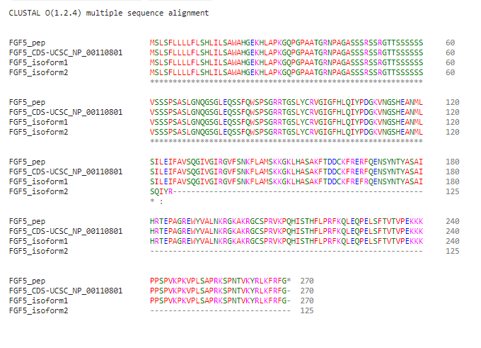
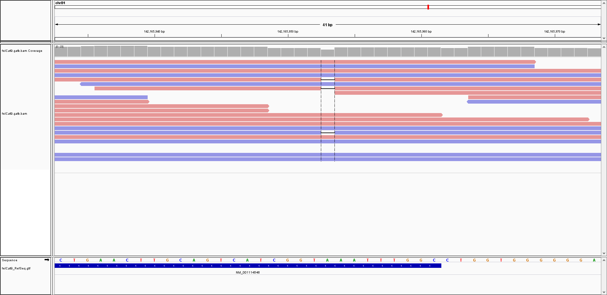
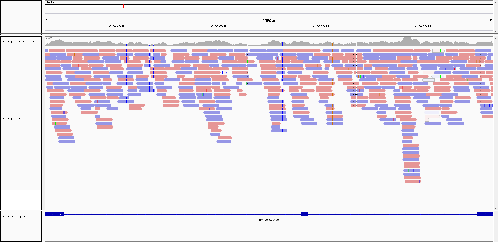
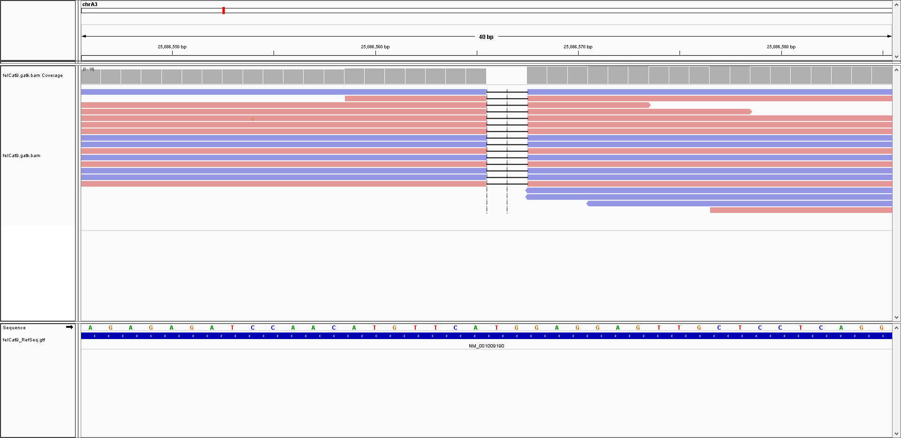
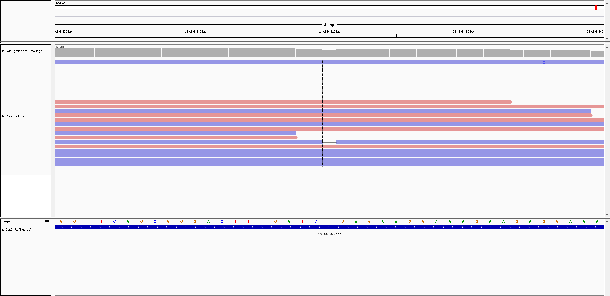

basepaws Amplicon-Seq Health Results
-----------------

For those who got the more typical sequencing (lcWGS ancestry + Amplicon-Seq health), there are these white papers to [learn more about the results](https://www.basepaws.com/wp-content/uploads/2019/09/Feline-Health-Markers.pdf).

Bastu not a carrier for any disease variants.

You can see Bastu's full report [here](https://github.com/cwarden45/Bastu_Cat_Genome/blob/master/Bastu_basepaws_lcWGS%2BAmpliconSeq_200108.pdf).

basepaws also has a [blog post](https://www.basepaws.com/blog/cat-coat-genetics/) about Cat Coat Genetics, but those are not currently covered in their report.

UC-Davis VGL "Ancestry Test" Traits
-----------------

<table>
  <tbody>
    <tr>
      <th align="center">Trait</th>
      <th align="center">Publications</th>
      <th align="center">Bastu's Result</th>
	  <th align="center">felCat9 Variant</th>
	  <th align="center">basepaws WGS Confirmation</th>
    </tr>
    <tr>
	    <td align="center"><b>Agouti</b> <i>Also in <a href="https://www.vgl.ucdavis.edu/services/coatcolorcat.php">Coat Test</a></i></td>
      <td align="left"><a href="https://www.ncbi.nlm.nih.gov/pubmed/25143047">Gershony et al. 2014</a> <a href="https://www.ncbi.nlm.nih.gov/pmc/articles/PMC3541004/">Lyons 2012</a></td>
      <td align="left">a/a</td>
	  <td align="left"><i>ASIP </i> <i><b>a</b>: </i>(c.122_123delCA)</td>
	  <td align="left"><b>a</b>: chrA3:25,086,566-25,086,567 (<b>Validated Homozygous</b>)</td>
    </tr>
    <tr>
	    <td align="center"><b>Brown</b> <i>Also in <a href="https://www.vgl.ucdavis.edu/services/coatcolorcat.php">Coat Test</a></i></td>
      <td align="left"><a href="https://www.ncbi.nlm.nih.gov/pubmed/16104383">Lyons et al. 2005</a> <a href="https://www.ncbi.nlm.nih.gov/pubmed/15858157">Schmidt-Küntzel et al. 2005</a> <a href="https://www.ncbi.nlm.nih.gov/pmc/articles/PMC3541004/">Lyons 2012</a></td>
      <td align="left">B/B</td>
	  <td align="left"><i>TYRP1 </i> <i>: </i>(c.8C > G) <i>: </i>(c.298C > T)</td>
	  <td align="left"></td>
    </tr>
    <tr>
	    <td align="center"><b>Colorpoint</b> <i>Also in <a href="https://www.vgl.ucdavis.edu/services/coatcolorcat.php">Coat Test</a></i></td>
      <td align="left"><a href="https://www.ncbi.nlm.nih.gov/pubmed/15771720">Lyons et al. 2005</a> <a href="https://www.ncbi.nlm.nih.gov/pmc/articles/PMC3541004/">Lyons 2012</a></td>
      <td align="left">C/C</td>
	<td align="left"><i>TYR </i> <i><b>Cb</b>: </i>(c.715G>T) <i><b>CS</b>: </i>(c.940G>A) <i><b>c</b>: </i>(c.975delC)</td>
      <td align="left"></td>
    </tr>
    <tr>
	    <td align="center"><b>Dilute</b> <i>Also in <a href="https://www.vgl.ucdavis.edu/services/coatcolorcat.php">Coat Test</a></i></td>
      <td align="left"><a href="https://www.ncbi.nlm.nih.gov/pubmed/16860533">Ishida et al. 2006</a> <a href="https://www.ncbi.nlm.nih.gov/pmc/articles/PMC3541004/">Lyons 2012</a></td>
      <td align="left">D/d</td>
	  <td align="left"><i>MLPH </i> <i><b>d</b>: </i>(c.83delT)</td>
	    <td align="left"><b>d</b>: chrC1:219,396,820 (<i>Present in <b>1</b> Read</i>)</td>
    </tr>
    <tr>
	    <td align="center"><b>MC1R</b> <i>Also "Amber" in <a href="https://www.vgl.ucdavis.edu/services/coatcolorcat.php">Coat Test</a></i></td>
      <td align="left"><a href="https://www.ncbi.nlm.nih.gov/pubmed/19422360">Peterschmitt et al. 2009</a> <a href="https://www.ncbi.nlm.nih.gov/pmc/articles/PMC3541004/">Lyons 2012</a></td>
      <td align="left">E/E</td>
	  <td align="left"><i>MC1R </i> <i><b>e</b>: </i>(c.250G>A)</td>
	  <td align="left"></td>
    </tr>
    <tr>
	    <td align="center"><b>Long Hair</b> <i>Also in <a href="https://www.vgl.ucdavis.edu/services/cat/CatLongHair.php">Long Hair Test</a></i></td>
      <td align="left"><a href="https://www.ncbi.nlm.nih.gov/pubmed/17433015">Drogemuller et al. 2007</a> <a href="https://www.ncbi.nlm.nih.gov/pubmed/17767004">Kehler et al. 2007</a> <a href="https://www.ncbi.nlm.nih.gov/pmc/articles/PMC3541004/">Lyons 2012</a></td>
      <td align="left">N/M3</td>
	  <td align="left"><i>FGF5</i> <i><b>M1</b>: </i>(c.356insT) <i><b>M2</b>: </i>(c.406C>T) <i><b>M3</b>: </i>(c.474delT) <i><b>M4</b>: </i>(c.475A>C)</td>
	    <td align="left"><b>M3</b>: chrB1:142,165,953 (<b>Validated Heterozygous</b>)</td>
    </tr>
    <tr>
	    <td align="center"><b>Cornish</b> <i>Also in <a href="https://www.vgl.ucdavis.edu/services/cat/CornishRex.php">Cornish Rex Coat Test</a></i></td>
      <td align="left"> <a href="https://www.ncbi.nlm.nih.gov/pmc/articles/PMC3541004/">Lyons 2012</a></td>
      <td align="left">N/N</td>
      <td align="left"><i>KRT71 </i></td>
      <td align="left"></td>
    </tr>
    <tr>
	    <td align="center"><b>Devon</b> <i>Also in <a href="https://www.vgl.ucdavis.edu/services/cat/SphynxDevonRexCoat.php">Sphynx/Devon Rex Test</a></i></td>
      <td align="left"><a href="https://www.ncbi.nlm.nih.gov/pubmed/20953787">Gandolfi et al. 2010</a> <a href="https://www.ncbi.nlm.nih.gov/pmc/articles/PMC3541004/">Lyons 2012</a></td>
      <td align="left">N/N</td>
	  <td align="left"><i>KRT71 </i> <i>: </i>(c.1108-4_1184del) <i>: </i>(c.1184_1185ins AGTTGGAG) <i>: </i>(c.1196insT)</td>
	  <td align="left"></td>
    </tr>
    <tr>
	    <td align="center"><b>Sphynx</b> <i>Also in <a href="https://www.vgl.ucdavis.edu/services/cat/SphynxDevonRexCoat.php">Sphynx/Devon Rex Test</a></i></td>
      <td align="left"><a href="https://www.ncbi.nlm.nih.gov/pubmed/20953787">Gandolfi et al. 2010</a> <a href="https://www.ncbi.nlm.nih.gov/pmc/articles/PMC3541004/">Lyons 2012</a></td>
      <td align="left">N/N</td>
	  <td align="left"><i>KRT71 </i> <i>: </i>()</td>
	  <td align="left"></td>
    </tr>
    <tr>
	    <td align="center"><b>Selkirk Rex</b> <i>Also in <a href="https://www.vgl.ucdavis.edu/services/cat/SelkirkRex.php">Selkirk Rex Coat Test</a></i></td>
      <td align="left"><a href="https://www.ncbi.nlm.nih.gov/pmc/articles/PMC3695623/">Filler et al. 2012?</a></td>
      <td align="left">N/N</td>
	  <td align="left"></td>
	  <td align="left"></td>
    </tr>
    <tr>
	    <td align="center"><b>Scottish Fold</b> <i>Also in <a href="https://www.vgl.ucdavis.edu/services/ScottishFold.php">Scottish Fold Test</a></i></td>
      <td align="left"><a href="https://en.wikipedia.org/wiki/Scottish_Fold">Wikipedia</a></td>
      <td align="left">N/N</td>
	  <td align="left"></td>
	  <td align="left"></td>
    </tr>
</tbody>
</table>

I think validating these markers in my WGS data may be more difficult than I was expecting.  For example, there were relatively few mutations in the [cat GAPDH gene](https://github.com/cwarden45/Bastu_Cat_Genome/blob/master/Basepaws_Notes/IGV_BWA-MEM_Realign_Coverage_GAPDH.PNG), but the handful of genes that I visualized in IGV seem to be noticably more divergent:

**FGF5 (Long Hair)**:

It took me a little while to sort through the details, but [Figure 1](https://www.ncbi.nlm.nih.gov/pmc/articles/PMC3756544/figure/F1/) in the [Kehler et al. 2007](https://www.ncbi.nlm.nih.gov/pubmed/17767004) paper shows the del474T mutation causing a frameshift towards the beginning of the 3rd exon in FGF5.

In particular, I have found that I need to use the CDS sequences from each of the separate 3 exons (Supplemental Figure A1-a to A1-c), to match the RefSeq protein sequence that I can download from UCSC:

You can also download GTF gene annotations, and I can **successfully validate Bastu's M3 mutation from her UC-Davis report in her basepaws WGS data**:

**ASIP (Agouti)**:

**MLPH (Dilute)**:

**TYR (Lynx/Siamese Point, Colorpoint Restriction)**:

In order for me to help keep track of these things, basepaws had a [blog post](https://www.basepaws.com/blog/cat-coat-genetics/) about traits (but I don't believe they have targeted sequencing of those regions, to include in the report).

(Selected) Other UC-Davis VGL Traits / Health Results
-----------------

<table>
  <tbody>
    <tr>
	<th align="center">Trait</th>
	<th align="center">Publications</th>
	<th align="center">felCat9 Variant</th>
	<th align="center">Bastu basepaws WGS</th>
    </tr>
    <tr>
	<th align="center">White Gloves Also in <a href="https://www.vgl.ucdavis.edu/services/coatcolorcat.php">Coat Test</a></th>
	<th align="left"><a href="https://www.ncbi.nlm.nih.gov/pubmed/25385592">Montague et al. 2014</a></th>
	<th align="left">KIT</th>
	<th align="left"></th>
    </tr>
    <tr>
	 <th align="center"><a href="https://www.vgl.ucdavis.edu/services/cat/DominantWhite.php">Dominant White & White Spotting</a></th>
	<th align="left"><a href="https://www.ncbi.nlm.nih.gov/pubmed/25085922">David et al. 2014</a></th>
	<th align="left">KIT</th>
	<th align="left"></th>
    </tr>
    <tr>
	<th align="center"><a href="https://www.vgl.ucdavis.edu/services/abblood.php">AB Blood Group</a></th>
	<th align="left"><a href="https://bmcgenet.biomedcentral.com/articles/10.1186/1471-2156-8-27">Bighignoli et al. 2007</a> <a href="https://www.ncbi.nlm.nih.gov/pmc/articles/PMC3541004/">Lyons 2012</a></th>
	<th align="left">CMAH (NeuGc Antigen)</th>
	<th align="left"></th>
    </tr>
</tbody>
</table>

I found a [Lyons 2012](https://www.ncbi.nlm.nih.gov/pmc/articles/PMC3541004/) review that seems to cover a lot of what I described above (even if it doesn't have a more direct publication).

I'm skipping some of the breed-specific diseases, although I would guess those might be covered by the targeted sequencing for basepaws (and I hope I will eventually have a report for my normal WGS data, as opposted to lcWGS and amplicon sequencing).

For human, I think I can use information in the BOOGIE paper ([Giollo et al. 2014](https://journals.plos.org/plosone/article?id=10.1371/journal.pone.0124579)) and/or [bloodTyper](https://bitbucket.org/lucare/bloodtyper/src/master/) ([Lane et al. 2018](https://www.ncbi.nlm.nih.gov/pubmed/29780001)) to determine my own blood type?

Optimal Selection Trait and Health Mutations
-----------------

As mentioned in [my blog post](http://cdwscience.blogspot.com/2019/12/review-of-results-data-from-3-cat-dna.html), there is at least one variant with questionable coverage with ~15x basepaws sequencing that could be validated from Optimal Selection (from the UC-Davis VGL results).  That was the dilute variant (d) in the MLPH gene.

You can also see Bastu's Optimal Selection report [here](https://github.com/cwarden45/Bastu_Cat_Genome/blob/master/Bastu_OptimalSelection_Report.pdf).

<table>
  <tbody>
    <tr>
	<th align="center">Trait</th>
	<th align="center">Publications</th>
	<th align="center">Bastu's Result</th>
	<th align="center">felCat9 Variant</th>
	<th align="center">Bastu basepaws WGS</th>
    </tr>
    <tr>
	<th align="center">Blood Type (3 variants)</th>
	<th align="left"><a href="https://www.ncbi.nlm.nih.gov/pubmed/27755584">Omi et al. 2016</a> <a href="https://www.ncbi.nlm.nih.gov/pubmed/27171395">Gandolfi et al. 2016</a> <a href="https://www.ncbi.nlm.nih.gov/pubmed/30235335">Kehl et al. 2018</a></th>
	<th align="left">Blood Type A (Neu5Gc Antigen)</th>
	<th align="left"></th>
	<th align="left"></th>
    </tr>
</tbody>
</table>

If I look into the details and see the same strategy is cited, then I will remove the blood type row from the additional UC-Davis traits section.  Currently, it looks like both strategies search for variants in the CMAH gene, so I would at least say that the strategies for assigning blood types are related.  Blood Type A is more common than Blood Type B.  So, assuming that Blood Type B shows a variant from the genome reference, I didn't define this as one of the variants to check with the higher coverage WGS data (since Bastu was Blood Type A).

The Optimal Selection results indicate that Bastu lacks any FERV1 insertions in the KIT gene, which I believe relates to the UC-Davis <a href="https://www.vgl.ucdavis.edu/services/cat/DominantWhite.php">Dominant White & White Spotting</a> tests mentioned above (where FERV1 is spelled out as "*feline endogenous retrovirus*").

I believe "Color Locus B" is the same as the "Brown" trait from the UC-Davis VGL, so I also omittted that from the table above.  I did not previously understand that "B/B" produces black pigment.  However, the UC-Davis [Coat Test](https://www.vgl.ucdavis.edu/services/coatcolorcat.php) does describe the variants for Chocolate and Cinnamon coat color.

Otherwise, Bastu's Optimal Selection report validated what I had from the UC-Davis VGL report.

She was not a carrier for any disease variants.

Other Notes
-----------------
There was a Twitter discussion about trait markers [here](https://twitter.com/esummerbell/status/1214252394223218688).
