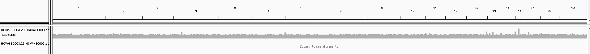
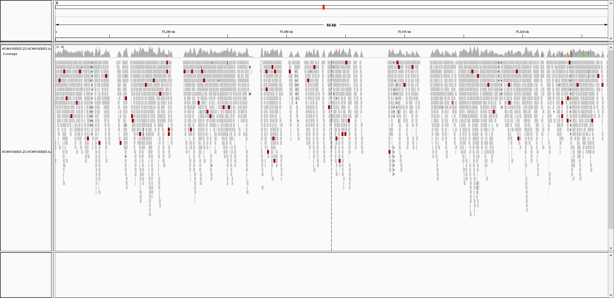
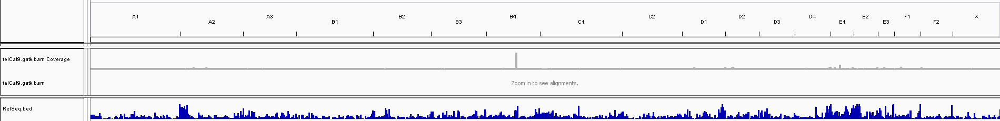
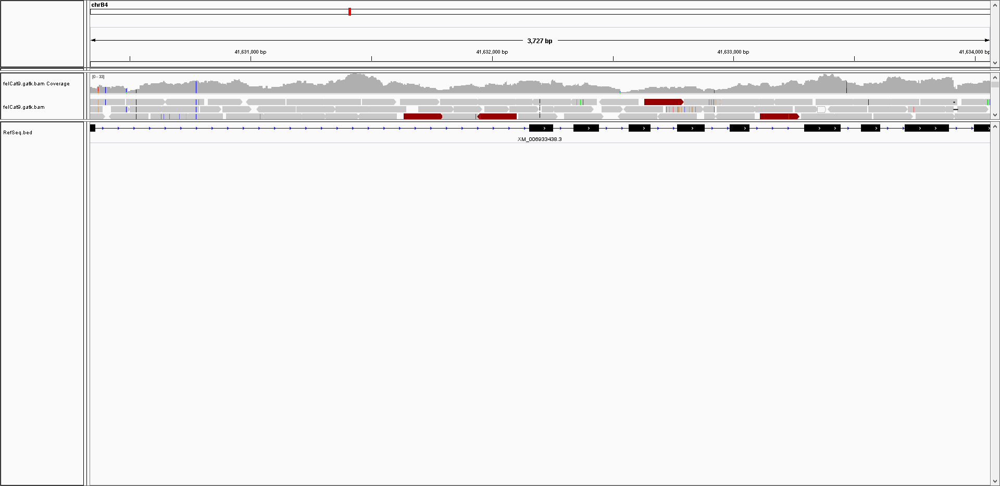

Personal Thoughts (and General Comments on Cat Genetics)
-----------------

As mentioned in the main section, I purchased two basepaws kits for Bastu: the typical ~0.5x sequencing (for $95) and ~15x sequencing (for $1000).  I only have the raw data for the higher coverage sequencing (and no PDF reports to provide), but I will add those PDF file to the main section (as soon as possible).

While I don't have a basepaws report for Bastu yet, you can see [this report](https://www.stopandeattheflowers.com/2019/03/25/basepaws-dna-catkit-update-8-image-heavy/) that somebody else posted on their blog.  There is also an [example report](https://cdn.basepaws.com/report/sample.html?_ga=2.137167092.538942964.1560707034-181695212.1554436045) on the basepaws website.

I have been commenting in a variety of mediums, so I thought I could collect those here (as well as add in some possibly relevant pictures from links).

For example, I should mention that basepaws customers are invited to a Facebook discussion group called "[Basepawssadors Cat DNA Club](https://www.facebook.com/groups/BasepawssadorsCatDNAClub/)"  I like that this creates a community of cat lovers, which includes a variety of comments (which could be people posting their results, or just cute cat videos).

While I may eventually convert some of this content into a blog post (and I am defintely going to update these pages), there is one thing that I can illustrate a little better than separate comments in the Facebook discussion group:

Namely, I think there is a difference between "ancestry" and "traits" that may need to be made more clear.

For example, if you see [Bastu's UC-Davis VGL report](https://drive.google.com/file/d/1FgYkv2x9Nri_mkmHsq1iWxNkwTuPhUlM/view?usp=sharing), or a [an earlier blog post for the UC-Davis VGL report for another cat](http://cdwscience.blogspot.com/2013/01/stormys-feline-dna-test.html), the flag indicates the "ancestry" (Western for both Bastu and Stormy) but there are "Phenotypic Markers" (or Traits) on the right side.  Notice the markers look like a regular genotype, and they represent specific loci.  For example, Bastu is not a Scottish Fold (but Stormy is a Scottish Fold).

As described in the separate **UC-Davis** [Feline Coat Color Tests](https://www.vgl.ucdavis.edu/services/coatcolorcat.php), there is a marker for ***Colorpoint Restriction***.

You can see the trait difference between Bastu and Stormy (the other cat), since Stormy has colorpoint marking on his ears and tails (this is also called "*Lynx point*" and "*Siamese point*," and this makes sense because Stormy has Siamese features).

In other words, Bastu is **C/C** and Stormy is **cS/cS**.  As defined on that other UC-Davis page:

"***C/C**: Full color, cat does not carry Burmese (sepia) or Siamese alleles*" --> makes sense for Bastu, who is a Tortoiseshell

"***c^s^ / c^s^**: Siamese*" --> makes sense for Stormy, who is most obviously a Scottish Fold (but also has the phenotype for the Lynx/Siamese point trait)

I am bringing this up these UC-Davis VGL results on the Basepaws discussion group because there are multiple people who have cats with Siamese traits that didn't have high ranking Siamese results in their basepaws report (based upon genome-wide distance to some set of reference cats).  If certain features are affected by a relatively small fraction of the genome (and sometimes even a limited number of genes), I think this is could be one factor (in addition to not being able to identify both alleles for traits with the low coverage ~0.5x sequencing that is currently being provided, and perhaps some details of how those percentiles are calculated)

As mentioned in [a comment to this Instagram post](https://www.instagram.com/p/Bu1uXAsAI6J/?fbclid=IwAR3TgmQ-wVweKm9bmzZFVgP-6vJAjfq8jeEMALVuwQa_XvO4cxtmgJos9Uw), "*we use 0.5x coverage for the calculation of the breed index only. For health markers we will be using targeted capture, single base extension sequencing with higher coverage or sanger based sequencing.*"  So, that trait information can't be provided until they do those additional experiments (and I think they may need to only provide the broader "Western-Eastern-Hybrid-Polycat" ancestry results in the future)

As another example, the group that created that cat ancestry test also has this [Kurushima et al. 2013](https://www.ncbi.nlm.nih.gov/pmc/articles/PMC3594446/) cat ancestry paper.

I think some people in the basepaws discussion group found the following ADMIXTURE plot to be confusing:


However, each column is essentially like the Western-Eastern-Hybrid-Polycat pie chart that you have in basepaws, but for some cat that is supposed to be a specific breed.

In other words, I am trying to bring this up for the "ancestry" versus "trait" part.  The meaning of the colors is kind of abstract, but cats with similar color bars are supposed to be more similar (and the breed should theoretically represent a mixture of populations defined by those colors, where "K" defines the number of populations that you expect to be present).

So, if you randomly select a bar from the Scottish Fold or British Shorthair (referred to as "British SH" above) sections, they look similar (even though the traits to define those breeds are quite different).  However, I would say that really means those cats have relatively similar ancestry.  I would be skeptical about some of the small percentages (there is almost always some amount of other color bars for each cat), the "Eastern" and "Western" assignments from the UC-Davis VGL report would come from running that program with **K=2**.

Plus, some traits are not mutally exclusive.  For example, you can be both a Scottish Fold and a British Shorthair.  However, if you have all the traits for both of those breeds, it is more like you are 100% Scottish Fold and 100% British Shorthair (not 50% Scottish Folder and 50% British Shorthair).

Also, when I was trying to find a version of the [Kurushima et al. 2013](https://www.ncbi.nlm.nih.gov/pmc/articles/PMC3594446/) Figure that would successfully appear on GitHub, I noticed that there was also an earlier [Lipinski et al. 2008 paper](https://www.ncbi.nlm.nih.gov/pubmed/18060738) , with the following ADMIXTURE plot:


This 2nd set of plot may make things more confusing, but I think the ADMIXTURE strategy is a good example of "[hypothesis generation](http://cdwscience.blogspot.com/2019/05/emphasizing-hypothesis-generation-in.html)" in genomics.  While using lower numbers of K may be more robust (and, the numbers of K used is in a smaller font in the upper-left corner), it may still be worth emphasizing that I always try to explain that several rounds of analysis and discussion are required in a research setting (where my use of scripts is semi-automated at best).  In other words, as a Bioinformatics Specialist, I usually emphasize that "initial" results should not be thought of as final results that are immediately appropriate for publication.  In other words, some trial and error should be expected (this is why I think having access to raw data for re-analysis is crucial, and part of why you see various genomics reports change over time).  Importantly, in this context, I expect that is why results with varying values of K were presented.

Finally, before getting to the code for re-analysis part, here are some assorted general notes on things that I think may cause confusion:

**1)** I think this has been changed in some places (such as the Facebook discussion group), but I think the CatKit box still says "*The World's First At-Home Cat Genetics Test*".  This is not true (and I have commented about that [here](https://twitter.com/cwarden45/status/1109316444305526784), among other places).  Hopefully, that is just a matter of them needing to wait until they use up their current set of boxes.  As you can see above, Stormy clearly has a UC-Davis VGL result from 2013 (for example).

My main concern is not the comment itself (for example, I have a blog post about [speculative thoughts on providing generics through non-profits](http://cdwscience.blogspot.com/2019/05/speculative-opinion-possible-advantages.html), in which case the idea of "first" may not matter so much), but it is important to take the necessary amount of time be as accurate as possible (and this is also something that I am working on, including shorter pauses to select intermediate responses in everyday discussions).

**2)** There are some mentions of health applications, in the "*Coming Soon*" section (under "Know your cat - inside and out") on the [main basepaws website](https://www.basepaws.com/) (and this was also mentioned in the [Shark Tank pitch](https://www.facebook.com/basepaws/videos/509921596204779/)).  However, as I note above (in reference to additional strategies being needed [in the Instragram comment](https://github.com/cwarden45/Bastu_Cat_Genome/blob/master/Basepaws_Notes/README.md)), I would ***not*** be comfortable with the 0.5x sequencing for trait or health results (although, if people are interested, I would be glad to show screenshots of regions for Bastu's ~15x coverage, and I hope raw data is provided for other results, after they add all of the desired features).

And some minor points:

**a)** I think there is a typo in the date for this [basepaws post](https://www.basepaws.com/blog/wild-index-blurb).  2015 would be even earlier than the basepaws founding or the [basepaws Singularity case report](https://twitter.com/kristinwuhrman/status/1123578136736694277), and the next blog post was on 05/01/2017.

**b)** The Facebook discussion group should probably be updated to use the Western-Eastern-Hybrid-Polycat percentages (rather than the specific percentages), and I like their "**One simple cat DNA test, a lifetime of discovery**" catchphrase more than "*Most Accurate Cat DNA Test*" (which I think is harder to define than you might imagine, and/or may not be true).

I really hope I am not interpreted as being too negative: I think some things may need to be changed, but I very much hope and expect to see future changes with the same group of individuals.  So, I certainly want the members of basepaws to succeed and help with cat research.  I am also working out some details for my future workload (which will be covered in a later blog post, and I have some notes about corrections [here](https://sites.google.com/site/cwarden45/about-me)).  So, I have also made these types of mistakes, but it is important to take the correction of mistakes into consideration when planning for time that needs to be taken for a project in the future.

So, again, I am extremely happy to have some raw data for Bastu to analyze / re-analyze, and I am interested in hearing a variety of perspectives on cat genomics research.

Re-formatting Reference for .bam Alignment
-----------------

I think the "3" in my sample ID means that I am the 3rd person to have ~15x coverage WGS data from basepaws.  So, this section probably has limited appeal.  However, the formatting of my .bam file was a little different than you might expect:

**1)** I needed to convert the chromosome names on a FASTA reference sequence

So, first I downloaded the **felCat9.fa.gz** reference sequence from https://hgdownload-test.gi.ucsc.edu/goldenPath/felCat9/bigZips/

and I extracted that sequence using [7zip](https://www.7-zip.org/).

I wrote and ran the `reformat_UCSC_ref.pl` script to convert the chromosome names as follows:

```
chrA1 --> 1
chrA2 --> 2
chrA3 --> 3
chrB1 --> 4
chrB2 --> 5
chrB3 --> 6
chrB4 --> 7
chrC1 --> 8
chrC2 --> 9
chrD1 --> 10
chrD2 --> 11
chrD3 --> 12
chrD4 --> 13
chrE1 --> 14
chrE2 --> 15
chrE3 --> 16
chrF1 --> 17
chrF2 --> 18
chrM --> 20
chrX --> 19
```

This created a new file called ***felCat9_basepawsNum.fa***.

You can then import this reference into [IGV](https://software.broadinstitute.org/software/igv/) using "**Genomes** --> **Load genome from file...**"

**2)** Create .tdf coverage track using [IGV](https://software.broadinstitute.org/software/igv/), with  "**Tools** --> **Run igvtools...**" to select .bam file (and the *Count* command to create the .tdf file with name that is automatically generated as the Output File).

The alignment can be imported using "**File** --> **Load from file...**":

If you have created a .tdf file, that is automatically opened when you open the .bam file.



You can also zoom in to see areas that still may not have any coverage, but I think that is because they filtered repeat regions.  *I should also emphasize return of raw data for higher-coverage sequencing is not currently automated - the raw data was sent to me individually via e-mail.*



Re-analysis of Raw FASTQ Data
-----------------

```diff
- Please note that this (and the above) code requires some coding experience to edit for your own samples, and I can't really provide detailed support.  However, if you find this code helpful, then I think that is wonderful!
```

Again, this currently may not be very useful for many people (and the code is similar to what I have done for [my own human data](https://github.com/cwarden45/DTC_Scripts)), but I have performed the following re-analysis of Bastu's raw data:

**1)** `align_BWA_MEM.py` - align reads using [BWA-MEM](http://bio-bwa.sourceforge.net/), remove duplicates + sort + index with [Picard](https://broadinstitute.github.io/picard/)

-Use the UCSC reference above, without reformatting

**2)** You can then proceed like step #2 above.  For example, this is genome-wide coverage with the BWA-MEM re-alignment:



You can also download annotation tracks (with formatting matching the UCSC reference).  For example, here is coverage of the cat GAPDH gene:



The RefSeq gene track (the second track in both of the above screenshots), can be downloaded as follows:

*a)* Go to the [UCSC Genome Browser](https://genome.ucsc.edu/cgi-bin/hgGateway), and look for the cat felCat9 genome build.  You may need to enter "cat" where it says "Enter species or common name"

*b)* If you want to find coordinates of a gene (like GAPDH), you can do that through the main interface.

*c)* To download a .bed file (which can be loaded into IGV, just like a .bam file), go to "**Tools** --> **Table Browser**"

Select "Cat" genome (for assembly "Nov. 2017 (Felis_catus_9.0/felCat9")")

Select group "Genes and Gene Predictions" for track "NCBI RefSeq"

Choose "BED - browser extensible data" as the output format.

To download the file (rather than opening the content in your web-browser), enter a name like *RefSeq.bed* for the output file.

When you click "**get output**", you will have to option to include flanking sequence.  However, I would recommend not doing that (just click "**get BED**" in the next window)
