The first steps of analysis are meant to match the [comment discussion](https://www.nature.com/articles/s41598-019-42455-9#article-comments) for the eDNA paper.

**1)** Trim adapters using [cutadapt](https://cutadapt.readthedocs.io/en/stable/) with `run_cutadapt.py`

You can also run `collect_FastQC_adapters.py` and `plot_adapter_results.R` to summarize the effect of the cutadapt trimming.

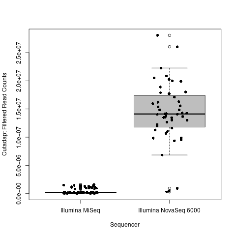

**2)** Run [DADA2](https://benjjneb.github.io/dada2/tutorial.html) using `run_DADA2-by_machine.R` or `run_DADA2-separate_serial.R`

I am skipping the 4 PhiX outliers, but it looks like running cutadapt removed a lot of the PhiX NovaSeq reads (when they would have been present at <1% frequency)?  This would match a response from the authors in the comment thead.

**3)** Summarize DADA2 merged and corrected sequence counts using `DADA-corrected_count_summary.R`

**NOTE: The DADA2 analysis is still running, so this is a partial set of results**

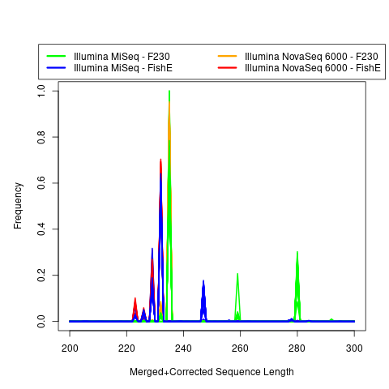

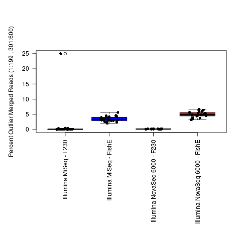

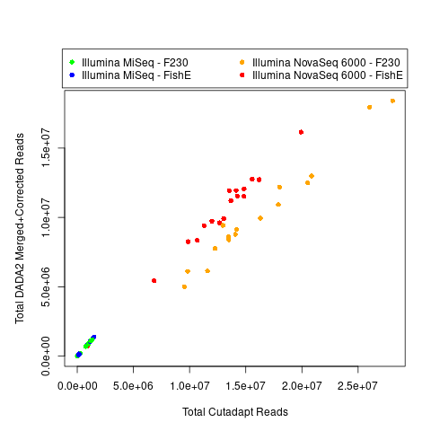

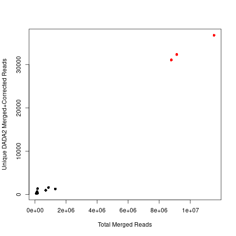

 vs Total Merged")

 vs Total Merged")

You can download the DADA2-corrected reads that I generated [here](https://zenodo.org/record/4546559/files/DADA2_Corrected_Reads.tar.gz).  However, these may be different from the exact set of DADA2-corrected reads used in the paper.

**4)** For comparison, merge sequences using [PEAR](https://cme.h-its.org/exelixis/web/software/pear/) (`run_PEAR.py`) and/or [FLASH](https://ccb.jhu.edu/software/FLASH/) (`run_FLASH.py`) and count unique sequences using [mothur](https://mothur.org/) (`run_mothur-unique_seqs.py`).

*4a)* Use `reformat_unique_FASTA.py` to combine information from the mothur files (and perhaps later be modified for sequence features).

*4b)* Create a combined count table and plots (`unique_count_summary_and_table.R` followed by `unique_count_plots.R`).

***For the PEAR-Merged Reads:***

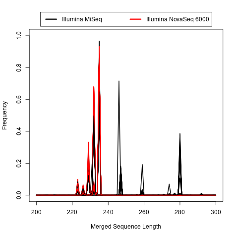

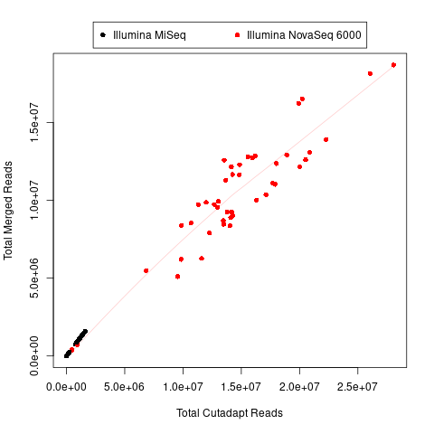

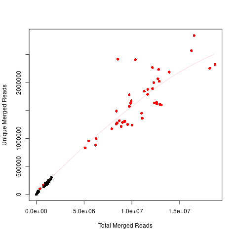

 vs Total Merged")

 vs Total Merged")

Unique sequences and counts for PEAR-merged reads can be downloaded [here](https://zenodo.org/record/4546559/files/PEAR-Merged_Reads.tar.gz).

***For the FLASH-Merged Reads:***

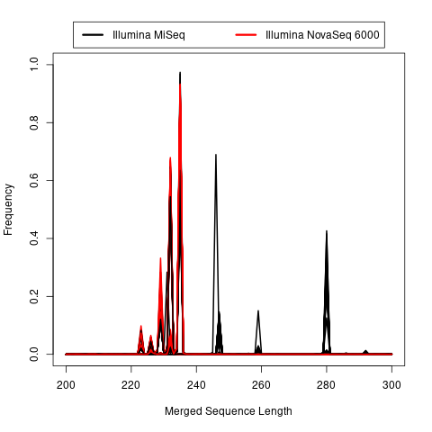

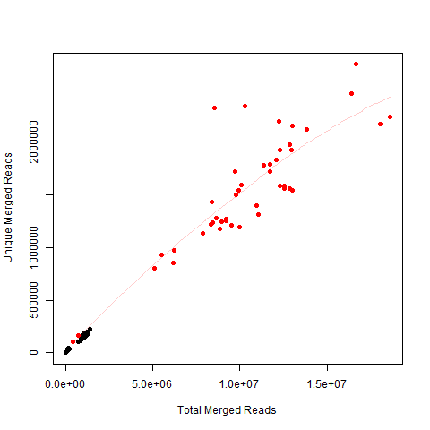

 vs Total Merged")

 vs Total Merged")

Unique sequences and counts for FLASH-merged reads can be downloaded [here](https://zenodo.org/record/4546559/files/FLASH-Merged_Reads.tar.gz).

*4c)* The exported length matrices can be used to check the percent outlier merged lengths using `unique_count-additional_length_analysis.R`.

***For the PEAR-Merged Reads:***

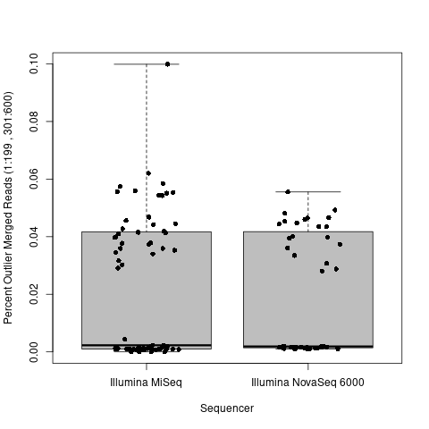

***For the FLASH-Merged Reads:***

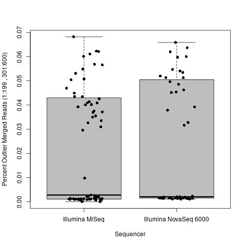
