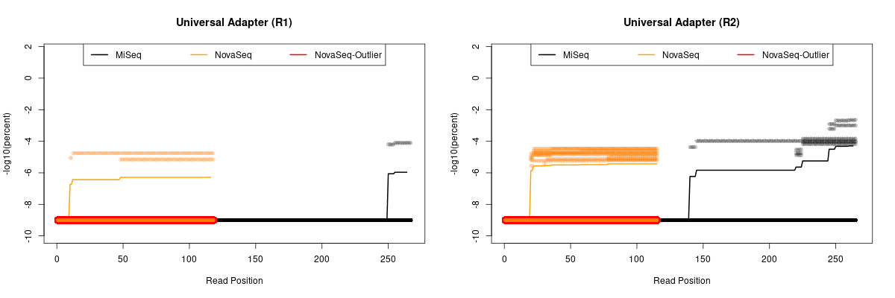
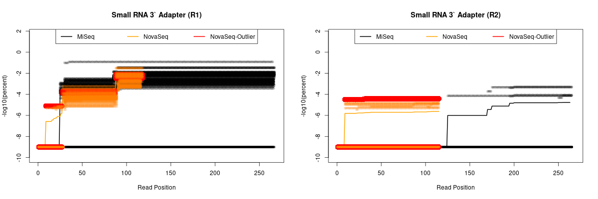
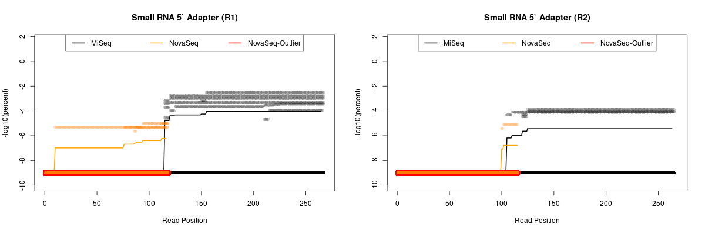
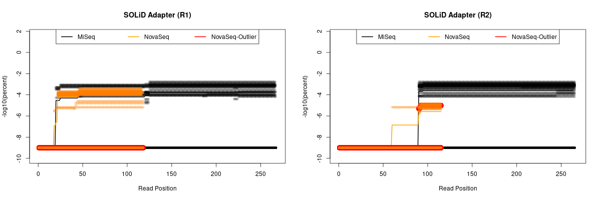
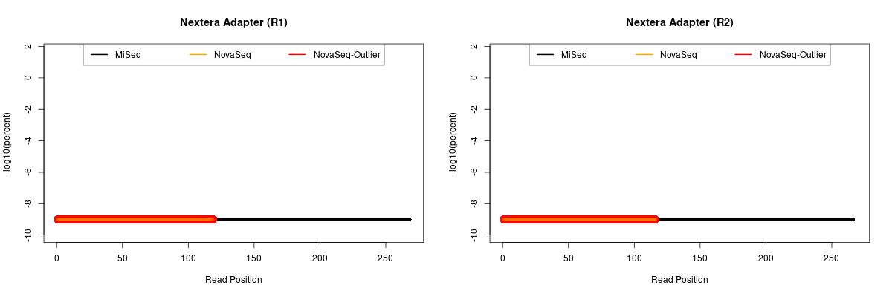
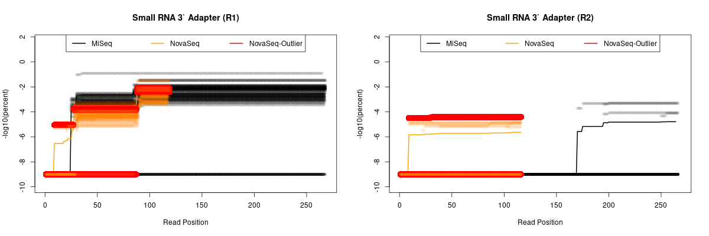

For plotting the FastQC adapter percentages, values less than 1E-10 were set to that value (unless that is beyond the read length).

---

**When I checked one of the samples for running cutadapt, it looks like the Nextera adapters were all removed but some Small RNA 3\` Adapters were still present.**

This comes from the code in the [DADA2 section](https://github.com/cwarden45/Bastu_Cat_Genome/tree/master/Basepaws_Notes/Read_QC/PRJNA513845-eDNA/DADA2).

After re-downloading reads, there were 0  samples with all reads in the cutadapt-filtered files.  However, some samples have noticably more reads than others.
