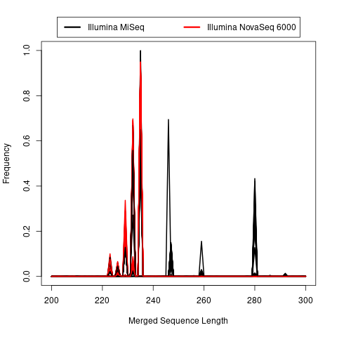
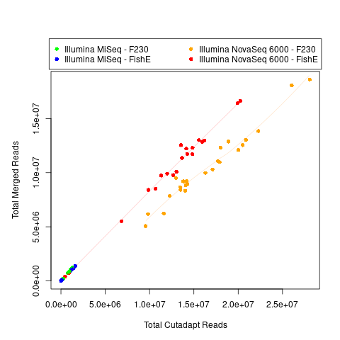
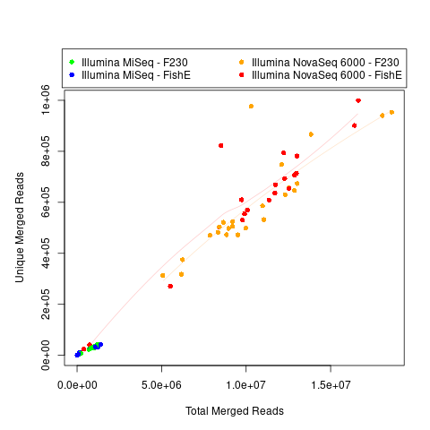
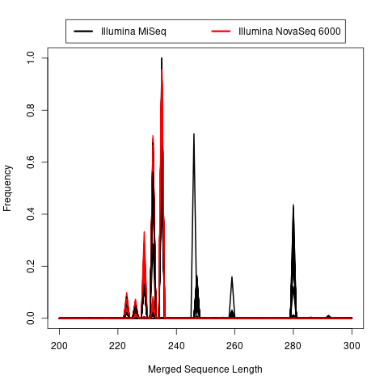
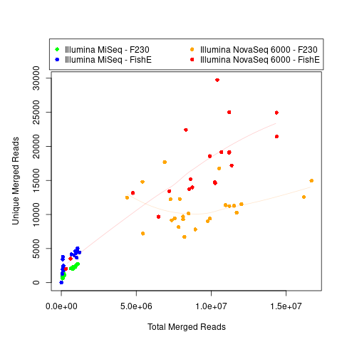
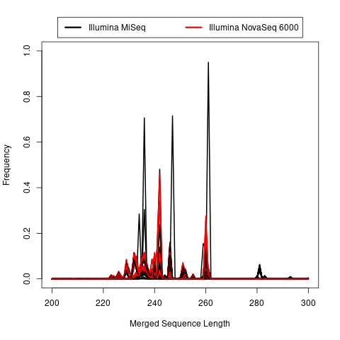
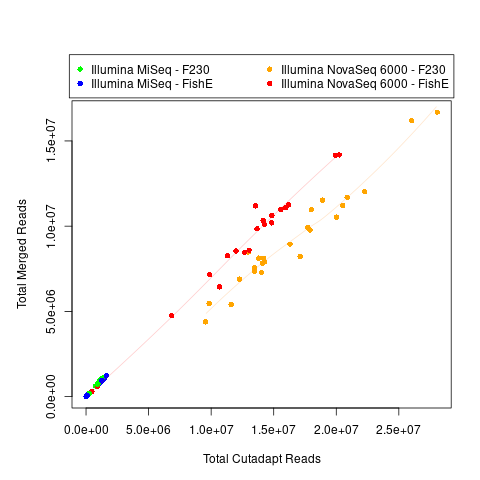
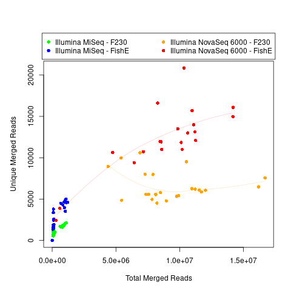

**1)** Collect unique sequences into 1 file using `combine_unique_sequences-multiread-swarm.py`

**2)** Run one of the following OTU clustering methods

*a)* [swarm](https://github.com/torognes/swarm)

The input FASTA file must be created using `combine_unique_sequences-multiread-swarm.py` (versus a version where the sequences are combined without including the count in the name)

Swarm is then run using `run_swarm.py`.

This ran successfully and was faster than VSEARCH for the set of sequences present in at least 2 reads for at least 1 sample.  So, I will test Swarm with the full set of reads.

*b)* [vsearch](https://github.com/torognes/vsearch) using `run_vsearch.py`

You can see a legend for the vsearch `--uc` output file [here](https://manpages.debian.org/stretch/vsearch/vsearch.1).

<table>
  <tbody>
    <tr>
      <th align="center">Method</th>
      <th align="center">Input</th>
      <th align="center">Run Time</th>
    </tr>
    <tr>
	    <td align="center">Swarm</td>
      <td align="center">All FLASH-Merged Reads</td>
      <td align="center">2:38:09</td>
    </tr>
    <tr>
	    <td align="center">Swarm</td>
      <td align="center">FLASH-Merged Reads (<i>Min 2 Reads in at least 1 Sample</i>)</td>
      <td align="center">0:21:27</td>
    </tr>
    <tr>
	    <td align="center">VSEARCH</td>
      <td align="center">FLASH-Merged Reads (<i>Min 2 Reads in at least 1 Sample</i>)</td>
      <td align="center">0:37:31</td>
    </tr>
</tbody>
</table>

When looking at sequences present in at least 2 reads in 1 sample, I could run Swarm and DADA2 (run separately on each sample, in serial) at the same time.  While VSEARCH could run to completion, it caused  DADA2 to stop running (and I therefore expect greater computational resource requirements).  I think this also why I can run Swarm but not VSEARCH on the full set of reads.

**3)** Create revised count table of counts based upon mapping between clusters and each unique sequence using `create_OTU_count_table-uclust_format-SWARM_MAPPING.pl` or `create_OTU_count_table-uclust_format-SWARM_MAPPING-serial_lower_memory.pl`

I believe that you can install the full [BioPerl](https://bioperl.org/index.html) dependency by entering a `cpan` shell and running `install Bundle::BioPerl` (as described [here](http://etutorials.org/Programming/perl+bioinformatics/Part+II+Perl+and+Bioinformatics/Chapter+9.+Introduction+to+Bioperl/9.2+Installing+Bioperl/)), and/or `cpanm Bio::Perl` (as described [here](https://stackoverflow.com/questions/47966512/error-installing-xmldomxpath)).  You can also try to run `cpan Bio::SeqIO` or `cpanm Bio::SeqIO` for just this particular script.  I found that I needed to download the .tar.gz file for [XML::DOM::XPath](https://metacpan.org/pod/XML::DOM::XPath) under **Tools --> Download (12.12Kb)** (on the left, towards the middle), and then change the *t/test_non_ascii.t* file to say "*use utf8;*" instead of "use encoding '*utf8';*" (as described in [this discussion](https://stackoverflow.com/questions/47966512/error-installing-xmldomxpath), with complication from source following [these instructions](https://www.thegeekstuff.com/2008/09/how-to-install-perl-modules-manually-and-using-cpan-command/)).

**4)** Similar to the [original unique count tables](https://github.com/cwarden45/Bastu_Cat_Genome/tree/master/Basepaws_Notes/Read_QC/PRJNA513845-eDNA/DADA2), create summary plots using `unique_count_summary_and_table.R` followed by `unique_count_plots.R` (2 sequencer groups) or `unique_count_plots-2.R` (4 sequencer +  amplicon groups).

**##### Swarm (all FLASH-Merged Reads) #####:**

 vs Total Merged")

 vs Total Merged")

The OTU sequences mapped to each sample can be downloaded [here](https://zenodo.org/record/4546559/files/FLASH-Swarm_OTU-all.tar.gz).

**##### Swarm (FLASH-Merged Reads, minimum 2 in at  least 1 sample) #####:**

 vs Total Merged")

 vs Total Merged")

**##### VSEARCH(FLASH-Merged Reads, minimum 2 in at  least 1 sample) #####:**

 vs Total Merged")

 vs Total Merged")

**5)** Use `combine_unique_sequences-multiread-OTU.py` to create the input files for a MegaBLAST search for the reduced set of OTU sequences (with name matching count files, and possibly subject to additional filters).
