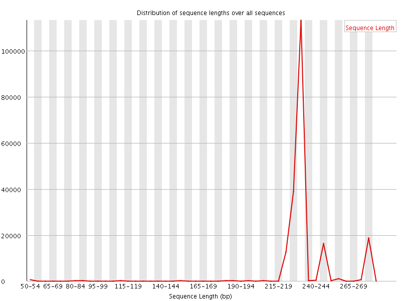

This is not analysis of Bastu's WGS data, and instead this relates to [this post-publication discussion](https://www.nature.com/articles/s41598-019-42455-9#article-comments).

However, you might be able to define the common goal as troubleshooting possible barcode issues from read analysis.

If you can successfully separate cross-contamination, this could relate to metagenomics analysis of remaining reads for the cat and human WGS data.

I am not entirely sure why my code is not idetnifying any barcodes, but I started to look at 1 example.

For example, here are the 1st 3 paired-end reads for SRR8423864:

```
>R1
ACTTTACTTGATTTTTGGTGGGTTATCAGGAGTTTTGGGTACTACTATGTCTGTGCTTATTCGTCTTCAATTAGCTAGTCCTGGCAACGATTTTTTAGGCGGTAATCATCAACTATATAATGTTATTGTTACAGCTCATGCCTTTTTAATGATTTTTTTTATGGTTATGCCAGTTCTTATAGGATGCTTTTGTAACTGGTTATTTCCACTTATTATTGGTGCACCTGATATT
>R2
CATATCATGTTCTCCAATCATAAGTGTTACTATCCAGTTACCAATTCCTCCTATAAGTACTGGCATAACCATAAAAAAAATCATTAAAAATGCATGAGCTGTAACAATAACATTATATAGTTGATGATTACCGCCTAAAAAATCGTTTCCAGGACTAGCTAATTTACTACGAATAAGCACAGACATAGTAGTACCCAAAACTCCTGATAACCCACCAAACATCAAGTAAAGTTTGCCCATGTCTTTCTTCTTAGT
>R2_revcom
ACTAAGAAGAAAGACATGGGCAAACTTTACTTGATGTTTGGTGGGTTATCAGGAGTTTTGGGTACTACTATGTCTGTGCTTATTCGTAGTAAATTAGCTAGTCCTGGAAACGATTTTTTAGGCGGTAATCATCAACTATATAATGTTATTGTTACAGCTCATGCATTTTTAATGATTTTTTTTATGGTTATGCCAGTACTTATAGGAGGAATTGGTAACTGGATAGTAACACTTATGATTGGAGAACATGATATG

>R1
ACTTTACTTGATTTTTGGTGGGTTATCAGGAGTTTTGGGTACTACTATGTCTGTGCTTATTCGTCTTCAATTAGCTAGTCCTGGCAACGATTTTTTAGGCGGTAATCATCAACTATATAATGTTATTGTTACAGCTCATGCCTTTTTAATGATTTTTTTTATGGTTATGCCAGTTCTTATAGGATGCTTTGGTAACTGGTTAGTTCCCCTTATTATTGGTTCCCCTGTTATG
>R2
CCTATCCTGTGCTCCAATCATAAGTGTTACTAACCAGTTTCCAAAGCCTCCTATAAGTACTTGCATAACCATTATTAATATCATTAAAAATGCATGAGCTGTAACAATTACATTTTATAGTTGATTATTACCTCCTAACAAATCGTTTCCAGGACTAGCTATTTTAAGACGAATAATCTCACACATAGTAGTACCCAAAACTCCTGTTAACCCACCAAAAATCAAGTAAAGT
>R2_revcom
ACTTTACTTGATTTTTGGTGGGTTAACAGGAGTTTTGGGTACTACTATGTGTGAGATTATTCGTCTTAAAATAGCTAGTCCTGGAAACGATTTGTTAGGAGGTAATAATCAACTATAAAATGTAATTGTTACAGCTCATGCATTTTTAATGATATTAATAATGGTTATGCAAGTACTTATAGGAGGCTTTGGAAACTGGTTAGTAACACTTATGATTGGAGCACAGGATAGG

>R1
TTTATATTTAATTTTTGGTGCTATTTCAGGTGTTGCAGGAACAGCATTATCTTTATACATTAGAATCACACTAGCGCAACCTAACAGTAGTTTCTTAGAATATAACCATCATTTATACAATGTTTTTGTAACAGGTCTTTCTTTTATTATGATTTTTTTTATGGTACTGCCTACATTAATTGGTGGTTTCTGCAACTGGTTTTTTCCGTTATTTATTGGTGCACCTGATATT
>R2
CATATCAGGTGCACCGATCATAATTGGGACAAACCAATTACCAAATCCACCAATCATTGCAGGCATTACCATGAAGAAAATCATTATTAATCCATGGCCTGTAACCAACACATTATATAAGTGATAGTTGCCACCTAAAATTCCATCACCAGGATGCATCAATTCAATTCTCATTAATACTGAAAAAGCTGTACCAATAATTCCTGCAACAATTGCAAAAATTAAATACATT
>R2_revcom
AATGTATTTAATTTTTGCAATTGTTGCAGGAATTATTGGTACAGCTTTTTCAGTATTAATGAGAATTGAATTGATGCATCCTGGTGATGGAATTTTAGGTGGCAACTATCACTTATATAATGTGTTGGTTACAGGCCATGGATTAATAATGATTTTCTTCATGGTAATGCCTGCAATGATTGGTGGATTTGGTAATTGGTTTGTCCCAATTATGATCGGTGCACCTGATATG
```

Raw reads from the Illumina sequencers should have the **same length** but you can see length variation in the above sequences as well as this FastQC summary for the forward read:


