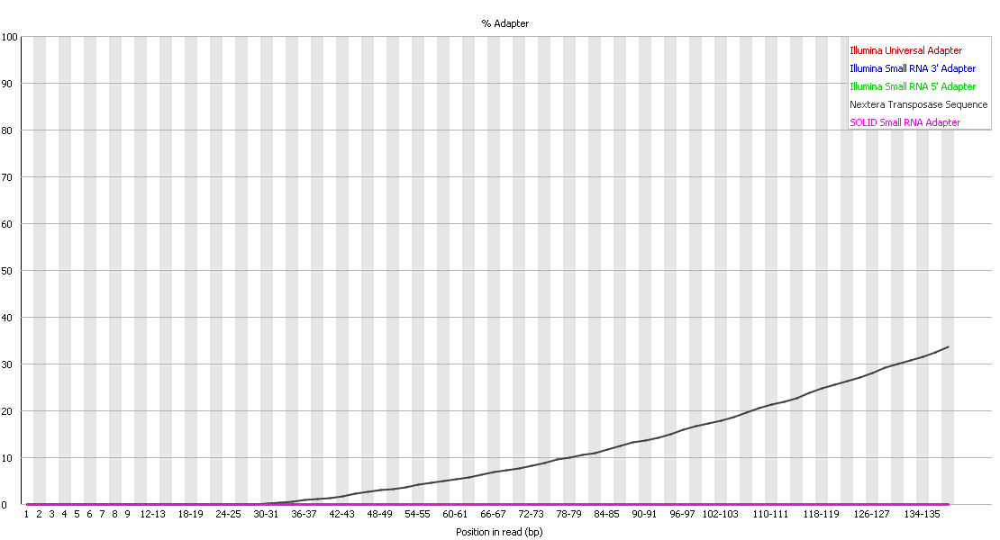
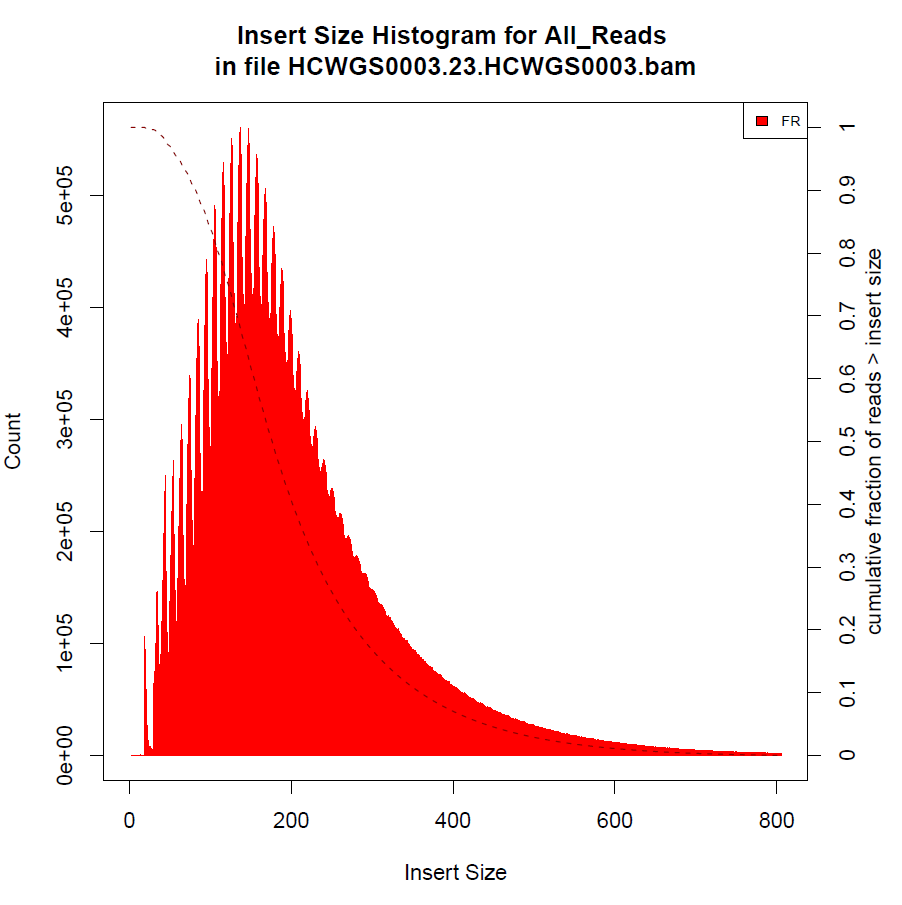
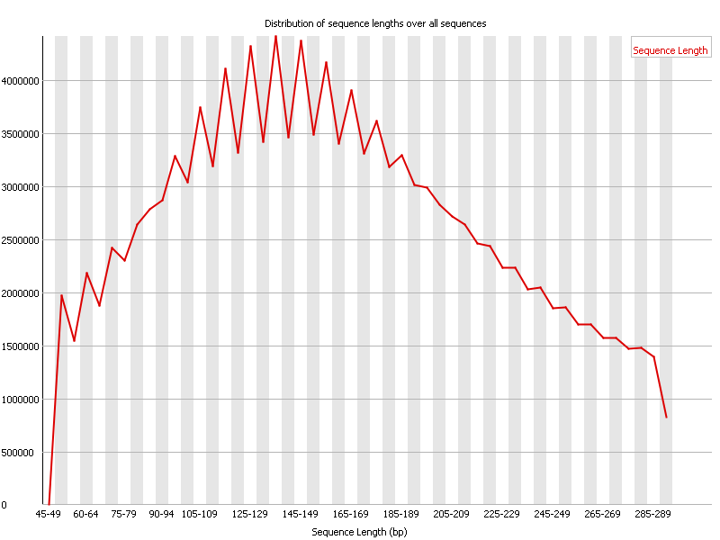
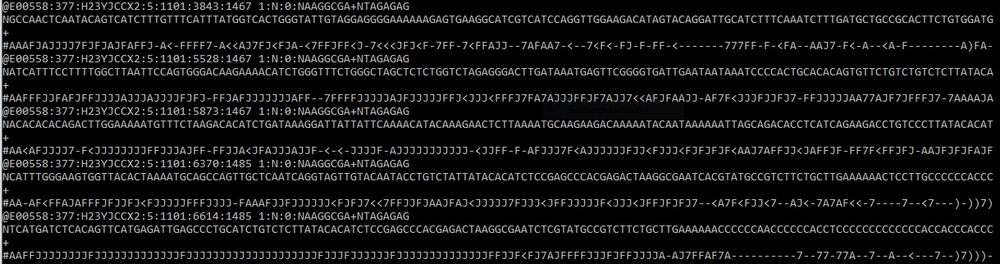
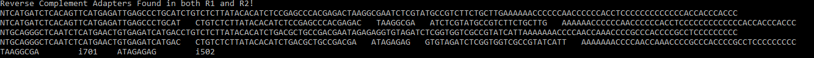

***Update (5/19/2021):*** I realized some content was not precisely true (the beginning if the file was not completely representative of the rest of the file).  So, I have corrected the content of the file.

***Update (6/6/2021):*** I updated the code to compare the bcl2fastq index sequence (within the read name) to what is observed within the R1 and R2 reads in the smaller fragments.  *This represents the "**-v2**" version of the scripts, and you can see the output files [here](https://github.com/cwarden45/Bastu_Cat_Genome/blob/master/Basepaws_Notes/Read_QC/barcodes-v2.xlsx) and [here](https://github.com/cwarden45/Bastu_Cat_Genome/blob/master/Basepaws_Notes/Read_QC/barcodes_strict-v2.xlsx).*  Most commonly, the degenerate "N" nucleotides do in fact match.  However, there are mismatches present in the R1/R2 that are not expected from the reported I1/I2 sequence, and there are mismatches in the reported I1/I2 sequence that may not in fact be mismatches in the R1/R2 sequence.  Also, allowing mismatches does not cause the nucleotide to become "N" - you can see that mismatches were allowed (following default parameters), ***but*** there are both 1 nt differences with the wrong nucleotide *or* the "N" nucleotide can count as a mismatch.

I first checked whether I could find PhiX reads in my sample, but there were 0 PhiX-aligned reads in this sample (using `Bowtie2_alignment_PE.sh`).  Perhaps this shouldn't be surprising, since I would guess these are dual-barcoded samples, and the PhiX spike-in doesn't have a barcode (for example, there was one sample where I could [reduce the number of PhiX reads from over 1 million to a couple dozen by using a 2nd barcode that was different](https://www.biostars.org/p/376585/#380738), because the PhiX samples should kind of be thought of like the single-barcode samples when processed as dual-barcode samples).  However, that same section of the Biostars discussion describe an eDNA diversity paper, where PhiX sequences were *more* prevalent in the NovaSeq SRA data than the MiSeq SRA data.

I also ran [FastQC](https://www.bioinformatics.babraham.ac.uk/projects/fastqc/) on the FASTQ files.

One thing that I thought may be interesting was the adapter distribution, which you can see here for the forward (R1) read:

and here for the reverse (R2) read:

Namely, the Nextera adapter can be found in quite a number of reads.  So, I think the fragment size is less than 150 bp for ~30% of the reads (the forward and reverse reads are 150 bp each).

The insert size calculation comes from the BAM alignment (rather than the FASTQ reads), but I thought it would be better to add here (because it probably is of less interest to most basepaws customers):

The insert distribution for the provided .bam file is shown above, but it looks practically the same as the re-aligned .bam file (for example, the mean insert size was 199 bp in the provided .bam and 202 bp in the re-aligned .bam file.

If there is overlap between the forward and reverse reads (for fragments less than 300 bp), you can also make a similar plot without the alignment.  For example, I used [PEAR](https://www.h-its.org/downloads/pear-academic/) to test merging reads (79.717% of reads could be assembled with PEAR), and FastQC to create a plot for the sequence length distribution:

If you are curious what a FASTQ file looks like, here is a screenshot for some of my reads:

For example, you can tell that this is a dual-barcode libary (where the barcodes for my sample should be AAGGCGA on one end of the fragment, and TAGAGAG at the other end of the fragment).  If you sequence 8 bp for an index but you only use 7 bp, then that is why there are N's.  You can also see more about the [FASTQ file format](https://en.wikipedia.org/wiki/FASTQ_format) on Wikipedia, and I have a diagram about the [barcoding design](https://www.biostars.org/p/376585/#376623) (based upon what somebody else drew for me) in the Biostars discussion about de-multiplexing.  You can also learn more about the Illumina adapter sequences [here](https://support.illumina.com/content/dam/illumina-support/documents/documentation/chemistry_documentation/experiment-design/illumina-adapter-sequences-1000000002694-09.pdf).  In terms of the general FASTQ format, you can also tell that all 166,490,724 paired-end reads were sequenced by machine E00558 in the 5th lane of flowcell H23YJCCX2.

Within the read, the "N" nucleotides may be the result of missing .bcl files.  In general, they represent a position where the true nucleotide sequence is relatively less clear.  For some applications, you may want to either filter those reads, or trim certain positions in the read.

Going back to the barcodes, Illumina describes the two sequences that should be adjacent to the barcode, and you can actually see the barcodes for your samples in the smaller fragments:

In this screenshot, I provide names for the I1(i7) and I2(i5) barcodes, but I've changed the "N" to a single-nucleotide.  This is because I created a script to count the barcodes next to the "read" sequence, and I noticed that the 8th nucleotide is not evenly distributed among the 1st position of each barcode.  This makes sense in that Illumina's official dual-index barcodes are an 8+8 design (and most frequently observed barcode pairs match Illumina's official sequences).  *However, to be clear, this is common at the beginning of the file, but the "N" nucleotide is no in the index for 100% of the reads*.

In particular, the code to count dual-barcodes observed within reads is in `parse_FASTQ_reads.pl`, and I converted the tab-delimited text file output an Excel file that I sorted by counts ([barcodes.xlsx](https://github.com/cwarden45/Bastu_Cat_Genome/blob/master/Basepaws_Notes/Read_QC/barcodes.xlsx)). If you ask what is the the most frequent barcode pair that exactly matches another pair of different samples, there are *11* reads with those pairs.

I also have a slightly different code that checks **both** ends of the sequence flanking the barcode (`parse_FASTQ_reads_strict.pl`), which I've also uploaded as [barcodes_strict.xlsx](https://github.com/cwarden45/Bastu_Cat_Genome/blob/master/Basepaws_Notes/Read_QC/barcodes_strict.xlsx).  Even though we know these reads got de-multiplexed to my sample, that reduces the maximum number of reads where I see another valid pair of Illumina barcodes as *1*.

However, while it is possible to have unique dual-barcodes (meaning that both I1 and I2 are each only used once to identify your sample), I believe combinatorial barcodes were used for these samples (meaning that I1 and I2 can be used for multiple samples, but the particular combination of I1 and I2 identifies your sample).  If I only match the "read," then the greatest number of reads with a different valid Illumina dual-index is **307** (i705 + i502); if I require an exact match of adapter sequence on both sides of the barcode, then the greatest number of reads with a different valid Illumina dual-index is **75** (i705+i502).

By default, I would prefer to err on the side of caution and add the `--barcode-mismatches 0` parameter for bcl2fastq (the program to generate the FASTQ files).  However, it looks like the 3rd party that does the base calling for basepaws went the other direction (they decided to only use 7/8 nucleotides for each barcode).  I would guess they did this because  they saw the greatest difference at that position: in ([barcodes.xlsx](https://github.com/cwarden45/Bastu_Cat_Genome/blob/master/Basepaws_Notes/Read_QC/barcodes.xlsx)), there are are **14,757,229 reads** with the exact i701+i502 barcodes, but ***200,507 reads*** have a mismatch at the 1st position in the I1 barcode and ***105,959 reads*** have a mismatch at the 1st position of the I2 barcode.  *You can imagine how this type of error rate could make mutation calling problematic, especially if you had low-coverage ~0.5x sequencing for $95 instead of ~15x sequencing for $1000 (or, currently, [$599](https://basepaws.com/products/whole-genome-sequencing)).*

While the PhiX example (in the [Biostars discussion](https://www.biostars.org/p/376585/#378708)) provides an example of something without a barcode getting into de-multiplexed samples, in terms of checking the barcodes that I can see as the reverse-complement of the other read in the pair, the results are mostly similar whether 1 or 2 immediately flanking sequences are required (and reads have an exact match to the intended barcode for my sample) in that ***96.5-97.0% of reads exactly match the expected barcode***.  If you could require that neither of the flanking sequence be exactly adjacent, then that number may go down.  However, this already gives people a way to check their own lower-coverage samples (after the FASTQ data is provided), as long as there are small fragments where the library sequence is with in the R1/R2 reads.

There also used to be a subfolder with indepndent eDNA analysis, but the primers (and therefore the barcodes) were often filtered from the reads uploaded in the SRA.  Also, to better connnect the data on [Zenodo](https://zenodo.org/record/4546559) that was moved to a separate repository ([here](https://github.com/cwarden45/PRJNA513845-eDNA_reanalysis))
