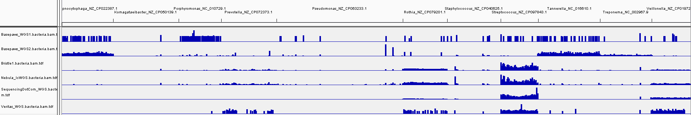
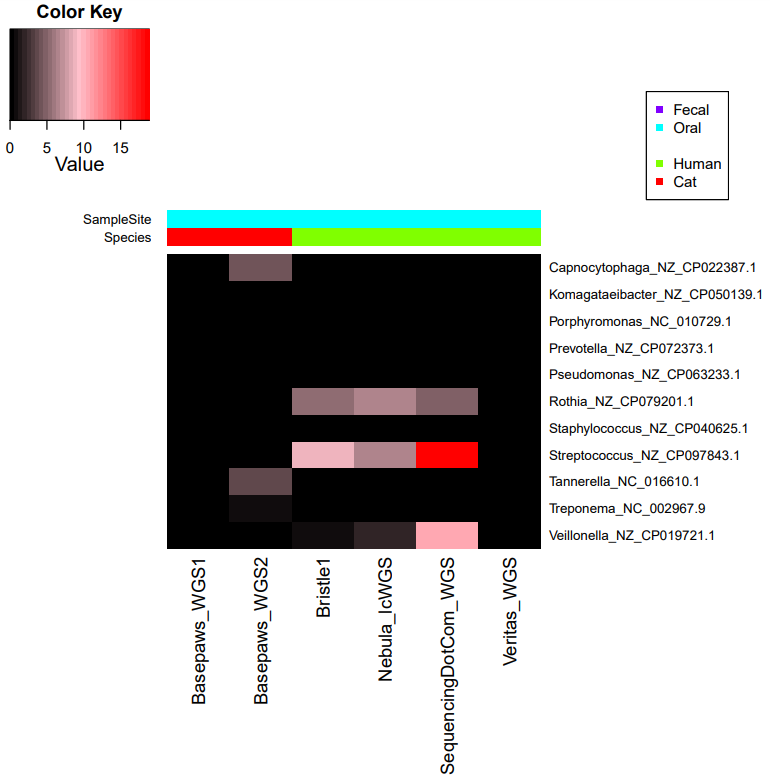
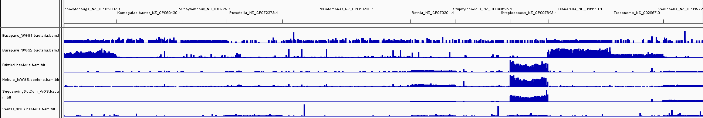
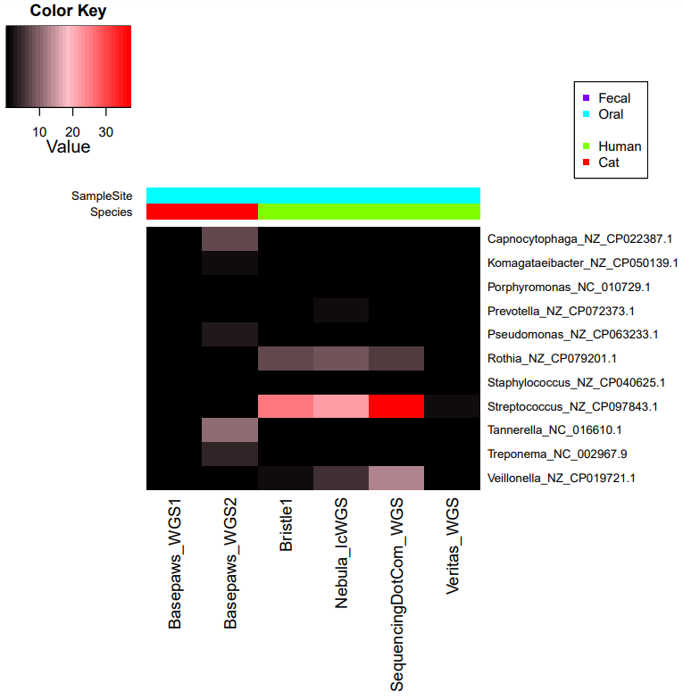

## Bacterial Reference Creation

This is something where it may help to discuss more with those that specialize in oral microbiology.

However, as a starting point, I have selected some sequences based upon at least one of the following categories:

**Category A: Brief Literature Search**

As discussed [here](https://github.com/cwarden45/Bastu_Cat_Genome/discussions/1), my understanding is that there is a **Red Complex** of bacteria affecting dental health (*Porphyromonas gingivalis*,*Treponema denticola*,*Tannerella forsythia*).

The exact species is different, but *Porphyromonas endodontalis* appeared in my [human dental health report](https://github.com/cwarden45/Bastu_Cat_Genome/discussions/1#discussioncomment-4082391).

<table>
  <tbody>
    <tr>
    	<th align="center">Genus</th>
	<th align="center">Species</th>
	 <th align="center">Accession to Test</th>
    </tr>
     <tr>
      <th align="center"><i>Porphyromonas</i></th>
      <th align="center"><i>gingivalis</i></th>
      <th align="center"><a href="https://www.ncbi.nlm.nih.gov/nuccore/NC_010729.1/">NC_010729.1</a></th>
    </tr>
     <tr>
      <th align="center"><i>Treponema</i></th>
      <th align="center"><i>denticola</i></th>
      <th align="center"><a href="https://www.ncbi.nlm.nih.gov/nuccore/NC_002967.9/">NC_002967.9</a></th>
    </tr>
     <tr>
      <th align="center"><i>Tannerella</i></th>
      <th align="center"><i>forsythia</i></th>
      <th align="center"><a href="https://www.ncbi.nlm.nih.gov/nuccore/NC_016610.1/">NC_016610.1</a></th>
    </tr>
</tbody>
</table>

**Category B: Abundant Kraken2/Braken Assignments for My Human Oral Samples**

<table>
  <tbody>
    <tr>
    	<th align="center">Genus</th>
	<th align="center">Species</th>
	 <th align="center">Accession to Test</th>
    </tr>
     <tr>
      <th align="center"><i>Streptococcus</i></th>
      <th align="center"><i>oralis</i></th>
      <th align="center"><a href="https://www.ncbi.nlm.nih.gov/nuccore/NZ_CP097843.1">NZ_CP097843.1</a></th>
    </tr>
     <tr>
      <th align="center"><i>Rothia</i></th>
      <th align="center"><i>dentocariosa</i></th>
      <th align="center"><a href="https://www.ncbi.nlm.nih.gov/nuccore/NZ_CP079201.1">NZ_CP079201.1</a></th>
    </tr>
      <tr>
      <th align="center"><i>Veillonella</i></th>
      <th align="center"><i>parvula</i></th>
      <th align="center"><a href="https://www.ncbi.nlm.nih.gov/nuccore/NZ_CP019721.1">NZ_CP019721.1</a</th>
    </tr>
      <tr>
      <th align="center"><i>Prevotella</i></th>
      <th align="center"><i>denticola</i></th>
      <th align="center"><a href="https://www.ncbi.nlm.nih.gov/nuccore/NZ_CP072373.1">NZ_CP072373.1</a</th>
    </tr>
</tbody>
</table>

**Category C: Abundant Kraken2/Braken Assignments for Candidate False Positives**

<table>
  <tbody>
    <tr>
    	<th align="center">Genus</th>
	<th align="center">Species</th>
	 <th align="center">Accession to Test</th>
    </tr>
     <tr>
      <th align="center"><i>Komagataeibacter</i></th>
      <th align="center"><i>rhaeticus</i></th>
      <th align="center"><a href="https://www.ncbi.nlm.nih.gov/nuccore/NZ_CP050139.1">NZ_CP050139.1</a></th>
    </tr>
     <tr>
      <th align="center"><i>Burkholderia</i></th>
      <th align="center"><i>dolosa</i></th>
      <th align="center"><a href="https://www.ncbi.nlm.nih.gov/nuccore/NZ_JAJFOB000000000.1">Incomplete Assembly?</a></th>
    </tr>
     <tr>
      <th align="center"><i>Staphylococcus</i></th>
      <th align="center"><i>aureus</i></th>
      <th align="center"><a href="https://www.ncbi.nlm.nih.gov/nuccore/NZ_CP040625.1">NZ_CP040625.1</a></th>
    </tr>
     <tr>
      <th align="center"><i>Pseudomonas</i></th>
      <th align="center"><i>fluorescens</i></th>
      <th align="center"><a href="https://www.ncbi.nlm.nih.gov/nuccore/NZ_CP063233.1">NZ_CP063233.1</a></th>
    </tr>
</tbody>
</table>
	  
If I remember correctly, I beleive *Staphylococcus* is a genus where there was eventually a conclusion that Kraken2/Braken assignments in a sample that should have little or no bacterial contamination were most likely false positives (with reads in a joint alignment mostly being homopolymers).  However, the top species assignment is different for my Veritas WGS sample (which comes from only hg19-aligned chromosomes and really should contain no true bacterial sequences) and the Basepaws samples.  In particular, I thought I recognized the *Staphylococcus cohnii* species as being what was a likely false postiive in a different situation, and should almost certainly be a false positive in this situation.  However, I am primarily trying to troubleshoot the Basepaws WGS samples and *Staphylococcus aureus* was the top speies assignmetn for those.
	  
Selecting a species for the *Pseudomonas* was more difficult.  The top species was different in each sample (*Pseudomonas tolaasii* for the Veritas WGS with hg19-aligned reads that were unlikely to be true bacterial reads, *Pseudomonas fluorescens* for the 1st Basepaws WGS sample, and *Pseudomonas resinovorans* foro the 2nd Basepaws WGS sample).  However, 2 out of the 3 had the most reads assigned to a species within the "Pseudomonas fluorescens group".  At the same time, I think this might affect the Bowtie2 alignment the most: I think BWA-MEM will probably align reads from related species to a sequence representive for the genus (with the human and cat reference genomes being used to capture false positives in a joint reference, with this more sensitive alignment).

Relative to the [first "Top 20" heatmap with both oral and fecal samples](https://github.com/cwarden45/Bastu_Cat_Genome/blob/master/Basepaws_Notes/Reformat_Basepaws_WGS2_and_Combine/n29_FILTERED_Braken_genera-heatmap_quantified-TOP20.pdf), fastp filtering and trimming [substantially reduced ***Komagataeibacter*** assignments ](https://github.com/cwarden45/Bastu_Cat_Genome/blob/master/Basepaws_Notes/Reformat_Basepaws_WGS2_and_Combine/fastp_results/Oral6SUB3_FILTERED_Braken_genera-heatmap_quantified-TOP20.pdf) from appearing at a 72.4% non-feline read frequency to **not appearing in the filtered set of genera assignments** (with a frequency of less than 0.5%). 

**So, based upon those sequences trimmed and filtered by fastp with the `--length_required 100 --n_base_limit 0` parameters, an additional sequence for one more genus was added:**

<table>
  <tbody>
    <tr>
    	<th align="center">Genus</th>
	<th align="center">Species</th>
	 <th align="center">Accession to Test</th>
    </tr>
     <tr>
      <th align="center"><i>Capnocytophaga</i></th>
      <th align="center"><i>stomatis</i></th>
      <th align="center"><a href="https://www.ncbi.nlm.nih.gov/nuccore/NZ_CP022387.1">NZ_CP022387.1</a></th>
    </tr>
</tbody>
</table>

As an additional note, a decrease in ***Moraxella*** assignments is mentioned in the [general discussion](https://github.com/cwarden45/Bastu_Cat_Genome/discussions/1).  However, the species above focus on high abundance assignments, and the risk scores for Bastu were based upon *decreased* abundance of *Moraxella*.

For example, there is a row for *Moraxella* in the original Kraken2/Braken [raw count table](https://github.com/cwarden45/Bastu_Cat_Genome/blob/master/Basepaws_Notes/Reformat_Basepaws_WGS2_and_Combine/n29_FILTERED_Braken_genera-counts.txt) but not the [filtered percentages](https://github.com/cwarden45/Bastu_Cat_Genome/blob/master/Basepaws_Notes/Reformat_Basepaws_WGS2_and_Combine/n29_FILTERED_Braken_genera-heatmap_quantified.txt) considered for visualization.

In order to facilitate parsing information from the alignment, I edited the exact sequence names in the bacterial reference file *Bacteria11.fa* (which is uploaded on this page, as the compressed file **Bacteria11.fa.gz**).

In order to create .bam alignment files with only Bacterial-aligned reads the uploaded **Bacteria11.bed** file was also created.

## Bowtie2 Bacterial-Alone Alignment (fastp-filtered reads)

**0)** Create index using the following commands:

```
FA=/path/to/Bacteria11.fa
ID=WgsOralBacteria11

bowtie2-build $FA $ID
```

**1)** Align reads for 6 oral samples using `run_Bowtie2_PE.py`.
	  
For the 2 Basepaws samples, `samtools idxstats` produced the following counts:
	  
<table>
  <tbody>
    <tr>
      <th align="center" rowspan="2">Genus</th>
      <th align="center" colspan="2">Basepaws WGS1</th>
      <th align="center" colspan="2">Basepaws WGS2</th>
    </tr>
    <tr>
      <th align="center">Mapped Read Segments</th>
      <th align="center">Unmapped Read Segments</th>
      <th align="center">Mapped Read Segments</th>
      <th align="center">Unmapped Read Segments</th>
    </tr>
    <tr>
      <th align="center"><i>Capnocytophaga_NZ_CP022387.1</i></th>
      <th align="center">47</th>
      <th align="center">51</th>
      <th align="center">5,868,526</th>
      <th align="center">384,570</th>
    </tr>
    <tr>
      <th align="center"><i>Komagataeibacter_NZ_CP050139.1</i></th>
      <th align="center">7</th>
      <th align="center">5</th>
      <th align="center">4,007</th>
      <th align="center">14,864</th>
    </tr>
    <tr>
      <th align="center"><i>Porphyromonas_NC_010729.1</i></th>
      <th align="center">101</th>
      <th align="center">95</th>
      <th align="center">354,214</th>
      <th align="center">117,369</th>
    </tr>
    <tr>
      <th align="center"><i>Prevotella_NZ_CP072373.1</i></th>
      <th align="center">0</th>
      <th align="center">0</th>
      <th align="center">33,802</th>
      <th align="center">17,146</th>
    </tr>
    <tr>
      <th align="center"><i>Pseudomonas_NZ_CP063233.1</i></th>
      <th align="center">7</th>
      <th align="center">7</th>
      <th align="center">81,907</th>
      <th align="center">86,880</th>
    </tr>
    <tr>
      <th align="center"><i>Rothia_NZ_CP079201.1</i></th>
      <th align="center">8</th>
      <th align="center">8</th>
      <th align="center">31,405</th>
      <th align="center">21,711</th>
    </tr> 
    <tr>
      <th align="center"><i>Staphylococcus_NZ_CP040625.1</i></th>
      <th align="center">19</th>
      <th align="center">20</th>
      <th align="center">11,351</th>
      <th align="center">12,383</th>
    </tr>
    <tr>
      <th align="center"><i>Streptococcus_NZ_CP097843.1</i></th>
      <th align="center">18</th>
      <th align="center">12</th>
      <th align="center">5,118</th>
      <th align="center">4,847</th>
    </tr>
    <tr>
      <th align="center"><i>Tannerella_NC_016610.1</i></th>
      <th align="center">39</th>
      <th align="center">39</th>
      <th align="center">5,555,787</th>
      <th align="center">1,241,463</th>
    </tr>
    <tr>
      <th align="center"><i>Treponema_NC_002967.9</i></th>
      <th align="center">8</th>
      <th align="center">8</th>
      <th align="center">1,444,457</th>
      <th align="center">468,864</th>
    </tr>
    <tr>
      <th align="center"><i>Veillonella_NZ_CP019721.1</i></th>
      <th align="center">6</th>
      <th align="center">1</th>
      <th align="center">3,114</th>
      <th align="center">3,909</th>
    </tr>
</tbody>
</table>

As a simplification, I defined a count for further analysis (such as heatmaps) as (Aligned Reads - Unaligned Reads)/2.  I am not sure why some genera had noticable counts in both columns.  However, I think this is a reasonable starting point, which can be studied in greater detail within the full alignments (if that might help).

**2)** TDF coverage files were created by importing **Bacteria11.fa** as the reference genome and running **Tools --> Run igvtools...** from [Integrative Genomics Viewer](https://software.broadinstitute.org/software/igv/).


	  
If there are high counts for classification for a genus/species and the reads can truely be uniquely assigned, then we would expect **relatively even** coverage across all genomic positions (and more sparce coverage for only certain parts of the genome could be consistent with false positive assignments, or the potential lack of true presence for that microbe).

When the file was small enough to be uploaded (for either of the previous steps), it was uploaded under [Bowtie2_Bacteria11_Alignment](https://github.com/cwarden45/Bastu_Cat_Genome/tree/master/Basepaws_Notes/Reformat_Basepaws_WGS2_and_Combine/Additional_Alignments/Bowtie2_Bacteria11_Alignment).
	  
**3)** Create adjusted/normalized count tables and heatmaps using `create_Bowtie2_table-NORMALIZE_KRAKEN2_BRAKEN.R`.



## BWA-MEM Joint Alignment (hg19+felCat9+Custom Bacteria, fastp-filtered reads)

**0)** Create index using the `create_multi-species_reference.pl`

**1)** Align reads for 6 oral samples using `run_BWA-MEM_PE.py`.
	  
For the 2 Basepaws samples, `samtools idxstats` produced the following counts:
	  
<table>
  <tbody>
    <tr>
      <th align="center" rowspan="2">Genus</th>
      <th align="center" colspan="2">Basepaws WGS1</th>
      <th align="center" colspan="2">Basepaws WGS2</th>
    </tr>
    <tr>
      <th align="center">Mapped Read Segments</th>
      <th align="center">Unmapped Read Segments</th>
      <th align="center">Mapped Read Segments</th>
      <th align="center">Unmapped Read Segments</th>
    </tr>
    <tr>
      <th align="center"><i>Capnocytophaga_NZ_CP022387.1</i></th>
      <th align="center">290</th>
      <th align="center">0</th>
      <th align="center">9,596,817</th>
      <th align="center">671,147</th>
    </tr>
    <tr>
      <th align="center"><i>Komagataeibacter_NZ_CP050139.1</i></th>
      <th align="center">567</th>
      <th align="center">0</th>
      <th align="center">1,669,148</th>
      <th align="center">247,723</th>
    </tr>
    <tr>
      <th align="center"><i>Porphyromonas_NC_010729.1</i></th>
      <th align="center">998</th>
      <th align="center">0</th>
      <th align="center">1,603,030</th>
      <th align="center">285,353</th>
    </tr>
    <tr>
      <th align="center"><i>Prevotella_NZ_CP072373.1</i></th>
      <th align="center">54</th>
      <th align="center">0</th>
      <th align="center">807,838</th>
      <th align="center">129,851</th>
    </tr>
    <tr>
      <th align="center"><i>Pseudomonas_NZ_CP063233.1</i></th>
      <th align="center">613</th>
      <th align="center">0</th>
      <th align="center">4,126,247</th>
      <th align="center">698,133</th>
    </tr>
    <tr>
      <th align="center"><i>Rothia_NZ_CP079201.1</i></th>
      <th align="center">198</th>
      <th align="center">0</th>
      <th align="center">524,389</th>
      <th align="center">72,173</th>
    </tr> 
    <tr>
      <th align="center"><i>Staphylococcus_NZ_CP040625.1</i></th>
      <th align="center">275</th>
      <th align="center">0</th>
      <th align="center">280,797</th>
      <th align="center">28,809</th>
    </tr>
    <tr>
      <th align="center"><i>Streptococcus_NZ_CP097843.1</i></th>
      <th align="center">205</th>
      <th align="center">0</th>
      <th align="center">201,758</th>
      <th align="center">19,256</th>
    </tr>
    <tr>
      <th align="center"><i>Tannerella_NC_016610.1</i></th>
      <th align="center">517</th>
      <th align="center">0</th>
      <th align="center">14,488,409</th>
      <th align="center">752,603</th>
    </tr>
    <tr>
      <th align="center"><i>Treponema_NC_002967.9</i></th>
      <th align="center">158</th>
      <th align="center">0</th>
      <th align="center">5,303,689</th>
      <th align="center">259,207</th>
    </tr>
    <tr>
      <th align="center"><i>Veillonella_NZ_CP019721.1</i></th>
      <th align="center">156</th>
      <th align="center">0</th>
      <th align="center">205,587</th>
      <th align="center">30,667</th>
    </tr>
</tbody>
</table>

As a simplification, I defined a count for further analysis (such as heatmaps) as (Aligned Reads - Unaligned Reads)/2.
	  

**2)** TDF coverage files were created by importing **Bacteria11.fa** as the reference genome and running **Tools --> Run igvtools...** from [Integrative Genomics Viewer](https://software.broadinstitute.org/software/igv/).
	  
The reference for BWA-MEM was **hg19_felCat9_Bacteria11.fa**.  However, the input for IGV is the *bacteria-filtered* .bam alignment file.  So, by using the reference with only bacteria to create the TDF files, is is easier to more directly compare the Bowtie2 (bacteria-only) and BWA-MEM (human hg19 + cat felCat9 + bacteria) alignments  



When the file was small enough to be uploaded (for either of the previous steps), it was uploaded under [BWA-MEM_Human-hg19_Cat-felCat9-Bacteria11_Alignment](https://github.com/cwarden45/Bastu_Cat_Genome/tree/master/Basepaws_Notes/Reformat_Basepaws_WGS2_and_Combine/Additional_Alignments/BWA-MEM_Human-hg19_Cat-felCat9-Bacteria11_Alignment).
	  
**3)** Create adjusted/normalized count tables and heatmaps using `create_BWA-MEM_table-NORMALIZE_KRAKEN2_BRAKEN.R`.


