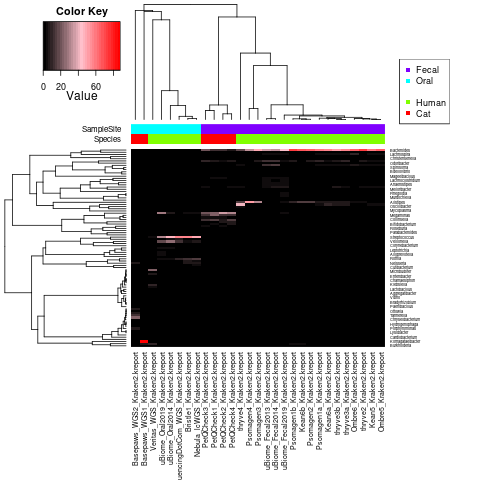
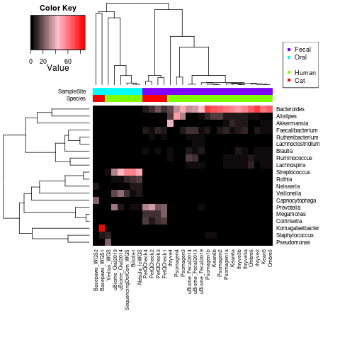
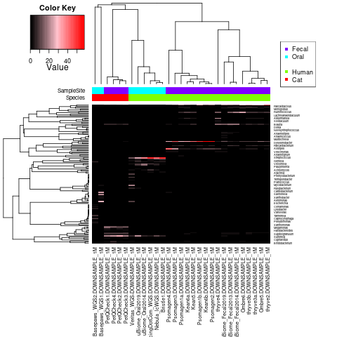
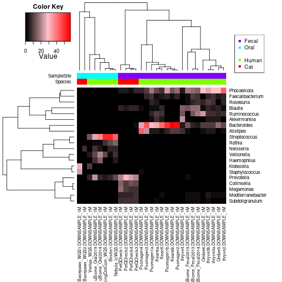
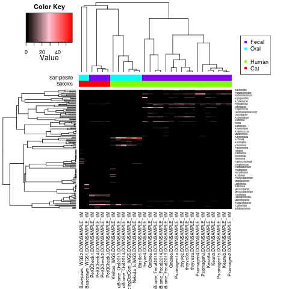
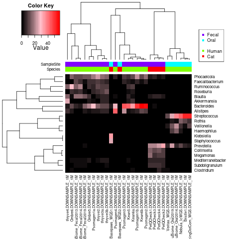
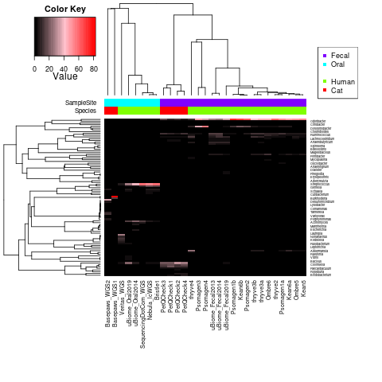
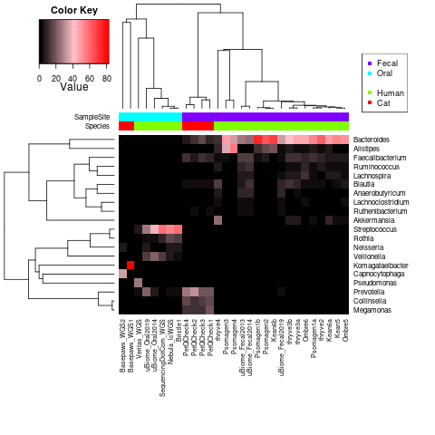
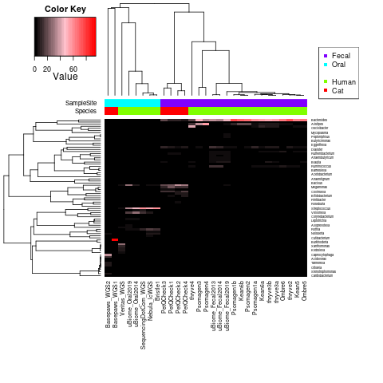

## Test Kraken2 Assignments *without* Bracken

**1)** Run `create_Kraken2_ONLY_table-INTERSPECIES_HOST.R` to generate below plots:

So, my impression is that running Bracken may help some, but many trends can be observed with only Kraken2.

## Test Alternative (Larger) Pre-Indexed Kraken2 Reference

**0)** Download "standard" reference from [here](https://benlangmead.github.io/aws-indexes/k2).

**1)** Run `run_Kraken2_Bracken-FASTQ-PE-low_RAM.py`, specifying larger reference.

Also, importantly, that script adds the `--memory-mapping` parameter to avoid receiving an error message.

**I encountered a considerable increase in the run-time when running Kraken2 in this way (with the much larger reference), from a total run-time of days to weeks/months**.  For high-frequency assignments, down-sampling reads (to be more like Nebula or Bristle) should help considerably.

## Test Alternative (Larger) Pre-Indexed Kraken2 Reference -- For 1 Million Reads (*maximum*)

**0)** Use [seqtk](https://github.com/lh3/seqtk) to extract 10,000 reads from each sample using `downsample-seqtk.py`.

**1)** Follow instructions above for attempted full sample classification, including running `run_Kraken2_Bracken-FASTQ-PE-low_RAM.py`.

**2)** Run `create_Kraken2_Bracken_table-INTERSPECIES_HOST.R` to generate below plots:

**3)** Similar to the first example within this subfolder, also run `create_Kraken2_ONLY_table-INTERSPECIES_HOST.R` to generate below plots:

## Test KrakenUnique Implementation within Kraken2

There is a [recent publication](https://joss.theoj.org/papers/10.21105/joss.04908) indicating improved memory usage for KrakenUniq, which mentions a preference to use KrakenUnique over Kraken2 for clinical applications.

However, [this protocol](https://www.ncbi.nlm.nih.gov/pmc/articles/PMC9725748/) describes an implementation of KrakenUniq within Kraken2 (when adding the `--report-minimizer-data --minimum-hit-groups 3` parameters).  So, a test of that quantification is shown below:

This requires using a **newer** version of Kraken2 than I previously tested (from [GitHub](https://github.com/DerrickWood/kraken2) instead of ["official release version"](https://ccb.jhu.edu/software/kraken2/index.shtml?t=downloads))

This **also** requires using a **newer** version of Bracken from [GitHub](https://github.com/jenniferlu717/Bracken).

**1)** Run `run_Kraken2_Bracken-FASTQ-PE--KrakenUniq_Implementation.py`, using the original *smaller* reference.

**2)** Run `create_Kraken2Uniq_Bracken_table-INTERSPECIES_HOST.R` to generate below plots (**With Bracken**):

**3)** Optionally, also run `create_Kraken2Uniq_ONLY_table-INTERSPECIES_HOST.R` to generate below plots (**Without Bracken - Kraken2Uniq implementation alone**):

