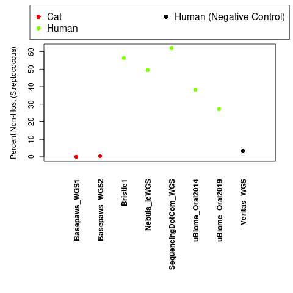
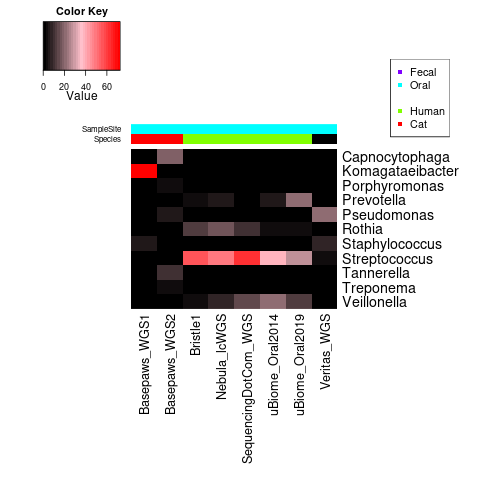
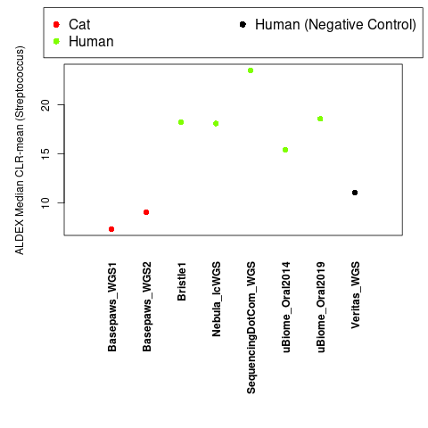
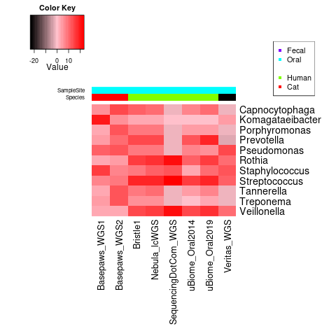
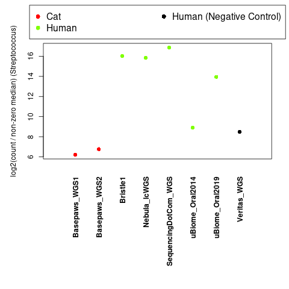
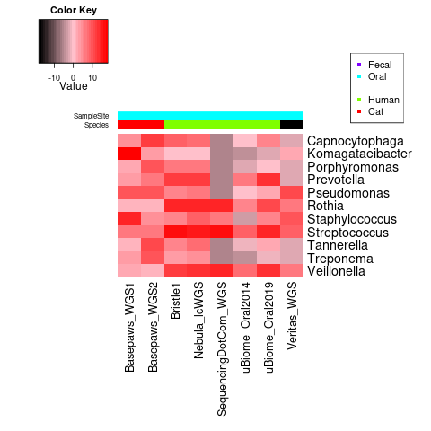

The [Basepaws preprint](https://www.biorxiv.org/content/10.1101/2021.04.23.441192v1) mentions applying a "Centered Log-Ratio (CLR) transformation" to Braken classifications.

While I think visual inspection of evenness of coverage can be useful, I do not believe that the separate [Bowtie2/BWA-MEM analysis with 11 representative sequences](https://github.com/cwarden45/Bastu_Cat_Genome/tree/master/Basepaws_Notes/Reformat_Basepaws_WGS2_and_Combine/Additional_Alignments) is appropriate to use for testing alterative normalizations (and essenitally needs to use an alternative set of total counts for normalization and percentage of non-host calculation).

However, I am going to use those genera as a guide for comparison for the Kraken2/Bracken assignments that I made for my samples (and add back in the uBiome 16S samples):

***i)*** Primarioly for human samples, create dot plot to see effect on *Streptococcus* abundance (but plot both human and cat)

***ii)*** For human and cat samples, *heatmap with 11 genera* used for alternative alignments.

## Direct Percent Non-Host Quantification

Plots below are created using `test1-direct_quantification.R`.





## ALDEx2 CLR Normalization (mean, default of `denom="all"`, use median for MonteCarlo simulations)

Plots below are created using `test2-ALDEx2_CLR.R`, with [ALDEx2](https://bioconductor.org/packages/release/bioc/html/ALDEx2.html) dependency.





## ALDEx2 Median Normalization (log ratio for median)

The original goal was to use ALDEx2 with `denom="median"`.  However, I recieved an error message that *"denom: 'median' unrecognized. Using all features."*.  So, I added 1 to all counts (to avoid taking a log of zero) and I manually normalized to the median count (among the **original non-zero values**), without the MonteCarlo instances.

So, plots below are created using `test3-log_median.R`.





## ALDEx2 IQLR Normalization (Inter-Quartile Log-Ratio,`denom="iqlr"`, described in [Quinn et al. 2018](https://bmcbioinformatics.biomedcentral.com/articles/10.1186/s12859-018-2261-8), use median for MonteCarlo simulations)

**NOTE:** When using **R v3.6.3**, I received the error message:

```
Error in apply(reads.clr[these.rows, ], 2, function(x) { :
  dim(X) must have a positive length
Calls: aldex.clr ... aldex.clr.function -> aldex.set.mode -> iqlr.features -> apply

```

When I used to use my Windows PC (instead of the Ubuntu server where all other genomic dependenies are installed) with **R v4.2.1**, I receive a similar error message.

I have started a troubleshooting thread [here](https://support.bioconductor.org/p/9148457/).

Plots below are created using `test4-ALDEx2_IQLR.R`, with [ALDEx2](https://bioconductor.org/packages/release/bioc/html/ALDEx2.html) dependency.


