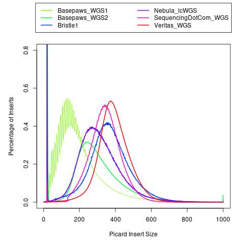

**1)** Estimate Insert Size using Paired-End Reads with `Picard_Insert_Size_Estimate.sh`

**2)** Summarize results using `plot_insert_density.R`

Values greater than 1000 are set to equal 1000 for plotting purposes.

When [running fastp](), remove trimmed reads whose length is less than 100.  This will not remove all smaller insert sizes, but I hope it helps some with the first Basepaws sample.
