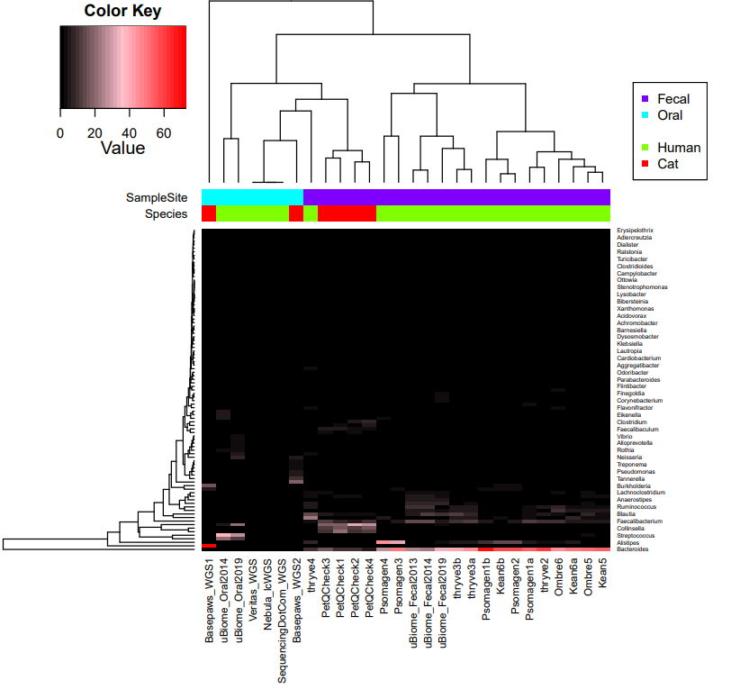

## Read Reformatting

**1)** Create separate R1 and R2 reads using `create_PairedEnd_R1_and_R2.pl`

Based upon the *deinterleave* process in [this code](https://github.com/metashot/kraken2/blob/master/modules/bbtools.nf), I believe this can also be performed using [BBtools](https://jgi.doe.gov/data-and-tools/software-tools/bbtools/).  **However**, the **read name** has to be changed in order to be able to combine the reads.  So, I think the custom script may in fact be needed for that.  Unfortuantely, I think this also means that Kraken2/Bracken cannot (or, ideally, should not) be run on the interleaved files that were provided.

**2)** Combine three separate .fastq.gz files (for R1 and R2) using `combine_reads.sh`

## Metagenomics Comparisons

**0)** Create links to reads for all samples to compare using `create_soft_links.sh`

For some early uBiome samples, uncompressed .fastq files were used to create compressed .fastq.gz files in the destination folder using `compress_earliest_uBiome.sh`

**1)** Run Kraken2/Bracken analysis using `run_Kracken2_Bracken-FASTQ-PE.py` from [paired human samples from multiple companies](https://github.com/cwarden45/DTC_Scripts/tree/master/Psomagen_Viome/Kraken2_analysis).

The output for Bastu's 1st WGS sample and the combined reads in the separate R1/R2 format are uploaded in [Kraken-OUT]().

The data type is different, but the 4 PetQCheck *fecal* samples have been uploaded under [PetQCheck-ReAnalysis](https://github.com/cwarden45/Bastu_Cat_Genome/tree/master/PetQCheck-ReAnalysis).  This also includes the full Kraken2 output files, where were too large to upload on GitHub for the 2 Basepaws (Oral) WGS samples.

**2)** Create summary table and heatmap for visualization using `create_Kracken2_Bracken_table-INTERSPECIES_HOST.R`, with [heatmap.3.R](https://github.com/obigriffith/biostar-tutorials/blob/master/Heatmaps/heatmap.3.R) as a dependency.

Assuming that cat reads will be misclassifed as human reads by Kraken2/Bracken, use different script than for paired human analysis (to only consider species considered part of microbiome).

**All Genera with Max Percent Reads >0.5%:**

**Top 10 Genera (by Average Non-Eukaryotic Percentage):**

## Re-Alignment for Germline Feline Variants

**1)** Use `align_BWA_MEM.py` from [top Basepaws_Notes folder](https://github.com/cwarden45/Bastu_Cat_Genome/tree/master/Basepaws_Notes).
