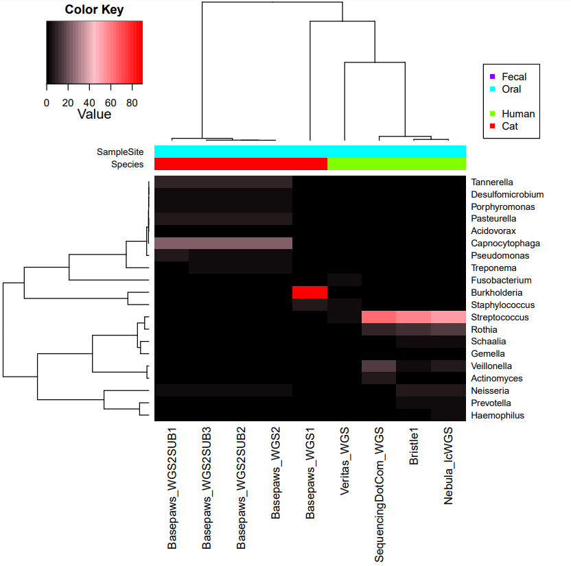

**1a)** Apply fastp with default settings using `run_fastp-default.sh`

**1b)** Apply fastp with `--length_required 100 --n_base_limit 0` settings using `run_fastp-AltParam2.sh`

Use relatively strict length requirement to try and help with classification.

**2)** Manually create summary table below (*divide fastp HTML read counts by 2 to get pair counts*):

<table>
  <tbody>
    <tr>
      <th align="center">Sample</th>
      <th align="center">Starting Pairs</th>
	  <th align="center">fastp Pairs (default)</th>
	  <th align="center">fastp Pairs (2 alt param)</th>
    </tr>
     <tr>
      <th align="center"><i>~~~Basepaws WGS Sample 1~~~</i></th>
      <th align="center">166,490,724 Pairs</th>
      <th align="center">166,025,522 Pairs (99.7% kept)</th>
      <th align="center">164,554,325 Pairs (98.8% kept)</th>
    </tr>
    <tr>
      <th align="center"><i>~~~Basepaws WGS Sample 2~~~</i></th>
      <th align="center">352,577,229 Pairs</th>
      <th align="center">349,326,731 Pairs (99.1% kept)</th>
      <th align="center">347,274,936 Pairs (98.5% kept)</th>
    </tr>
    <tr>
      <th align="center">Bristle Health (<i>Sample 1</i>)</th>
      <th align="center">5,173,777 Pairs</th>
      <th align="center">5,126,386 Pairs (99.1% kept)</th>
      <th align="center">5,076,106 Pairs (98.1% kept)</th>
    </tr>
    <tr>
      <th align="center">Nebula lcWGS</th>
      <th align="center">4,563,716 Pairs</th>
      <th align="center">4,471,632 Pairs (98.0% kept)</th>
      <th align="center">4,425,852 Pairs (97.0% kept)</th>
    </tr>
    <tr>
      <th align="center">Sequencing.com WGS</th>
      <th align="center">441,375,403 Pairs</th>
      <th align="center">441,347,357 Pairs (>99.9% kept)</th>
      <th align="center">438,516,531 Pairs (99.4% kept)</th>
    </tr>
    <tr>
      <th align="center">Veritas_WGS (<i>~~~Only hg19 Alignable Reads~~~</i>)</th>
      <th align="center">244,028,956 Pairs</th>
      <th align="center">237,085,540 Pairs (97.2% kept)</th>
      <th align="center">236,717,285 Pairs (97.0% kept)</th>
    </tr>
</tbody>
</table>

With the more stringent criteria, I also tested the separate runs/lanes for my 2nd Basepaws WGS samples

<table>
  <tbody>
    <tr>
      <th align="center">Sample</th>
      <th align="center">Starting Pairs</th>
	  <th align="center">fastp Pairs (default)</th>
	  <th align="center">fastp Pairs (2 alt param)</th>
    <tr>
      <th align="center">Basepaws WGS Sample 2 (SUBset 1) <i>(LP.858.D9.L1.R186)</i></th>
      <th align="center">5,440,561 Pairs</th>
      <th align="center"><i>Not Tested</i></th>
      <th align="center">5,359,316 Pairs (98.5% kept)</th>
    </tr>
    <tr>
      <th align="center">Basepaws WGS Sample 2 (SUBset 2) <i>(SP.319.D1.L2.R186)</i></th>
      <th align="center">232,909,392 Pairs</th>
      <th align="center"><i>Not Tested</i></th>
      <th align="center">229,462,509 Pairs (98.5% kept)</th>
    </tr>
    <tr>
      <th align="center">Basepaws WGS Sample 2 (SUBset 3) <i>(SP.329.E1.L2.R195)</i></th>
      <th align="center">114,227,276 Pairs</th>
      <th align="center"><i>Not Tested</i></th>
      <th align="center">112,453,111 Pairs (98.4% kept)</th>
    </tr>
</tbody>
</table>

**3)** Re-run Kraken2/Braken with more stringent filtering (`--length_required 100 --n_base_limit 0`) for samples listed above using `run_Kracken2_Bracken-FASTQ-PE.py`.

**4)** Then create summary table and heatmaps using `create_Kracken2_Bracken_table-INTERSPECIES_HOST.R`.

Technical replicates between lanes/runs are relatively consistent.  However, for the 6 without subseting after running fastp, [additional analysis](https://github.com/cwarden45/Bastu_Cat_Genome/tree/master/Basepaws_Notes/Reformat_Basepaws_WGS2_and_Combine/Additional_Alignments) for selected genera was then performed.
