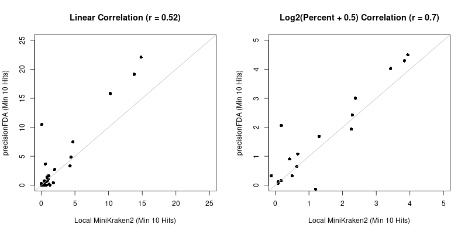
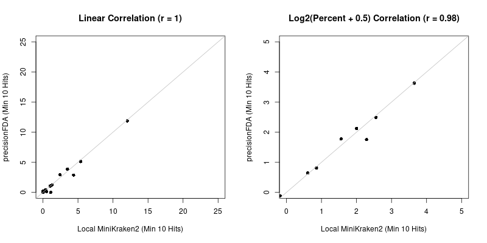

**Step 0)** If you don't already have an account, please [request an account](https://precision.fda.gov/request_access).

Also, if you already have an account, then you might want to take some time to familiarize yourself with the current interface.

For example, I had to learn/re-learn that the **Apps** created by others are under **My Home --> Everyone**.  Likewise, if you upload a file and then make that file **public**, then that file will appear from this location (rather default starting selection for *My Home --> Me*).

At least as of 12/22/2022, there is also general information [here](https://precision.fda.gov/docs/introduction).

**Step 1)** Small files can be uploaded from the web interface.  However, if Basepaws only provides data for Whole Genome Sequencing (WGS) customers, the you probably need to upload the files a different way.

**1a)** *Request a key* using a command Instructions that include Authorization Key generation are available [here](https://precision.fda.gov/assets/new).

**2a)** I uploaded my files using the Command Line Interface (CLI):

```
#!/bin/bash

KEY=[copy and paste temporary key for only your account]

/opt/pfda upload-file --key $KEY --file ../HCWGS0003.23.HCWGS0003_1.fastq.gz #Basepaws WGS1
/opt/pfda upload-file --key $KEY --file ../HCWGS0003.23.HCWGS0003_2.fastq.gz #Basepaws WGS1

/opt/pfda upload-file --key $KEY --file Basepaws_WGS2_R1.fastq.gz #Basepaws Reformatted WGS2
/opt/pfda upload-file --key $KEY --file Basepaws_WGS2_R2.fastq.gz #Basepaws Reformatted WGS2
```

If you wanted to compare to other oral samples for either Bastu (my cat) or myself (a human), then those are available within the following locations:

*Basepaws WGS1 (**cat**, described above)*: **Wait to re-try R1 and R2 upload**

*Basepaws WGS2 (**cat**, described above)*: **Wait to re-try R1 and R2 upload**


*Veritas WGS (only human-aligned from chromosome alignments, **approximate metagenomics negative control**)*: [R1](https://precision.fda.gov/home/files/file-FXyxPJQ0Vjj4FQVk354B168g-1) [R2](https://precision.fda.gov/home/files/file-FXyxPv80Vjj9b88QJz03kzKk-1) [Kraken2 Full Output](https://precision.fda.gov/home/files/file-GKvyVx002YvKV607BK9y9Y7j-1) [Kraken2 Report](https://precision.fda.gov/home/files/file-GKvyY9j02Yv0pyB33fPGgyqJ-1)
 - The precisionFDA output is also downloaded and provided in a completely public way in [report_Veritas-MiniKraken2-MIN_10_HITS.txt](https://github.com/cwarden45/Bastu_Cat_Genome/blob/master/Basepaws_Notes/Reformat_Basepaws_WGS2_and_Combine/precisionFDA-Sharing_and_Analysis/report_Veritas-MiniKraken2-MIN_10_HITS.txt).

*Nebula lcWGS (**human**, starting .fastq.gz)*: [R1](https://precision.fda.gov/home/files/file-Fb13k9j0Vjj5GjQXPQp5QFQF-1) [R2](https://precision.fda.gov/home/files/file-Fb13z000VjjBYJP2JbgyPVBb-1) [Kraken2 Full Output](https://precision.fda.gov/home/files/file-GP26Gk00JgVkFBy97Z30FPXF-1) [Kraken2 Report](https://precision.fda.gov/home/files/file-GP26Gp00JgVZBQGjGqvf85y8-1)
 - The precisionFDA output is also downloaded and provided in a completely public way in [report_Nebula_lcWGS-MiniKraken2-MIN_10_HITS.txt](https://github.com/cwarden45/Bastu_Cat_Genome/blob/master/Basepaws_Notes/Reformat_Basepaws_WGS2_and_Combine/precisionFDA-Sharing_and_Analysis/report_Nebula_lcWGS-MiniKraken2-MIN_10_HITS.txt).

*Sequencing.com WGS (**human**, starting .fastq.gz)*: **Re-upload attempt in progress**

*Bristle Health (**human**, starting .fastq.gz)*: **Waiting to be able to make R1 and R2 public**

I encountered some problems with some files staying in the "closed" state for a long time (using the `pfda` command when running from Ubuntu).  Following a discussion with support from precisionFDA, I deleted all of the more recently uploaded files.

In **Windows**, I copied the extracted executable into a given folder, and a ran a command in the following format (but with full text, not truely exported $KEY/$R1/$R2 variables):

```
pfda upload-file --key $KEY --file $R1
pfda upload-file --key $KEY --file $R2
```

**3)** For new samples, any Basepaws reads in a format similar to Bastu's 2022 sample will need to be reformatted.

For local reformatting, I provide options through [create_PairedEnd_R1_and_R2.pl](https://github.com/cwarden45/Bastu_Cat_Genome/blob/master/Basepaws_Notes/Reformat_Basepaws_WGS2_and_Combine/create_PairedEnd_R1_and_R2.pl) (requiring use of comments to select groups of variable names) or [create_PairedEnd_R1_and_R2-external_input.pl](https://github.com/cwarden45/Bastu_Cat_Genome/blob/master/Basepaws_Notes/Reformat_Basepaws_WGS2_and_Combine/precisionFDA-Sharing_and_Analysis/create_PairedEnd_R1_and_R2-external_input.pl).  The later can be run from the command line as described below:

```
#!/bin/bash

SHORT=LP.858.D9.L1.R186
IN=../AB.CN.45.31211051000777.LP.858.D9.L1.R186.WGS.fastq.gz
R1OUT=AB.CN.45.31211051000777.LP.858.D9.L1.R186.WGS_R1.fastq.gz
R2OUT=AB.CN.45.31211051000777.LP.858.D9.L1.R186.WGS_R2.fastq.gz


perl create_PairedEnd_R1_and_R2-external_input.pl --id=$SHORT --in=$IN --r1=$R1OUT --r2=$R2OUT
```

If using the strategies above, you may need to concatinate reads between separate runs/lanes.

In terms of working to develop an App for precisionFDA, I created a summary markdown file (also uploaded in this folder) and I used the following command to upload an "asset" to use as an App:

```
/opt/pfda upload-asset --key $KEY --name reformat_reduced_interleaved_FQ.tar --root . --readme reformat_reduced_interleaved_FQ.md
```

However, if I do successfully create an App, then these two separate steps would still be needed.  For example, I do not know if other customers will tend to recieve 3 interleaved files or a different number of starting files.

**4)** Unless future availability changes, you might only be able to run a certain version of Kraken2.  However, based upon [these results](https://github.com/cwarden45/Bastu_Cat_Genome/blob/master/Basepaws_Notes/Reformat_Basepaws_WGS2_and_Combine/Additional_Kraken_Classifications/README.md) perhaps using more stringent criteria (like `Minimum number of hit groups` = **10**) for a given sized reference, use of only that version of Kraken2 might be sufficient?

I also set `Print scientific names instead of just taxids` to **True**.

As a note, with only that single non-default parameter changes, I recieved the following error message:

```
IOError: [Errno 28] No space left on device Low scratch storage space
```

My understanding is that the instance configuration needed to be changed, so I took that into consideration for additional troubleshooting to re-run analysis within precisionFDA with **High Disk 2**.

With **High Disk 2**, I recieve the following error message:

```
Loading database information...Failed attempt to allocate 8000000000bytes;
you may not have enough free memory to load this database.
If your computer has enough RAM, perhaps reducing memory usage from
other programs could help you load this database?
classify: unable to allocate hash table memory

gzip: stdout: Broken pipe

gzip: stdout: Broken pipe
```

So, I then testing Kraken2 using **High Mem 4**.  That job was **successful**.

**5)** I used downloaded those results and used `create_Kraken2_ONLY_table-INTERSPECIES_HOST-pFDA.R` to create the following plot:



Similarly, I also analyzed the earlier Nebula lcWGS sample:



**So, I think might be encouraging that an unfiltered file (for Nebula lcWGS) shows *better* correlations than assignments made on only reads that could be aligned to hg19 (for the Vertias WGS file).**
